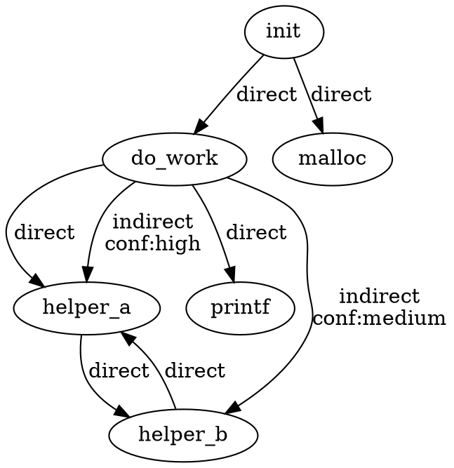

# siakam_callgraph_creator Implementation Plan

> **For agentic workers:** REQUIRED SUB-SKILL: Use superpowers:subagent-driven-development (recommended) or superpowers:executing-plans to implement this plan task-by-task. Steps use checkbox (`- [ ]`) syntax for tracking.

**Goal:** Build a SKILL that generates high-accuracy call graphs for C kernel/driver/firmware projects by combining Python-based tree-sitter parsing with LLM-driven indirect call resolution.

**Architecture:** Three-module pipeline — Module A (Python) parses C code into nodes/edges/indirect points; Module B (LLM prompt docs) resolves function pointer targets via parallel subagents with checkpointing; Module C (Python) merges results into callgraph.json, callgraph.dot, indirect_call.json, and entry.json.

**Tech Stack:** Python 3, tree-sitter-c, tree-sitter Python bindings, pytest, sha256 hashing, Graphviz DOT format.

---

## File Structure

```
siakam_callgraph_creator/
├── skill.md
├── module_a/
│   ├── __init__.py
│   ├── models.py
│   ├── uid_generator.py
│   ├── ignore_parser.py
│   ├── indirect_detector.py
│   ├── c_parser.py
│   ├── analyzer.py
│   └── tests/
│       ├── __init__.py
│       ├── conftest.py
│       ├── test_ignore_parser.py
│       ├── test_function_detection.py
│       ├── test_direct_edges.py
│       ├── test_indirect_detection.py
│       ├── test_syntax_error.py
│       ├── test_macro_handling.py
│       └── fixtures/
│           └── (104 subdirs: <category>/<example>/)
├── module_b/
│   ├── analyze_indirect.md
│   ├── orchestrator.md
│   └── tests/
│       ├── fixtures/
│       │   └── (30 indirect_point JSON files)
│       ├── expected/
│       │   └── (30 expected result JSON files)
│       ├── mock_indirect_points.json
│       ├── pre_existing/
│       │   ├── <uid1>.json
│       │   └── <uid3>.json
│       ├── run_analysis_test.md
│       └── run_orchestrator_test.md
├── module_c/
│   ├── __init__.py
│   ├── merge.py
│   ├── entry_finder.py
│   └── tests/
│       ├── __init__.py
│       ├── conftest.py
│       ├── test_merge.py
│       ├── test_entry_finder.py
│       ├── test_indirect_summary.py
│       ├── fixtures/
│       │   ├── nodes.json
│       │   ├── edges.json
│       │   ├── indirect_points.json
│       │   └── indirect/
│       │       ├── aaaaaaaa.json
│       │       ├── bbbbbbbb.json
│       │       └── cccccccc.json
│       └── expected/
│           ├── callgraph_expected.json
│           ├── callgraph_expected.dot
│           ├── indirect_call_expected.json
│           └── entry_expected.json
└── tests/
    ├── e2e_project/
    │   ├── .siakamignore
    │   ├── main.c
    │   ├── driver.c
    │   ├── ops.c
    │   └── include/
    │       └── api.h
    ├── expected/
    │   ├── nodes.json
    │   ├── edges.json
    │   ├── indirect_points.json
    │   ├── indirect/
    │   │   └── (per-fixture uid files)
    │   ├── callgraph.json
    │   ├── callgraph.dot
    │   ├── indirect_call.json
    │   └── entry.json
    └── run_e2e_test.md
```

---

## Phase 0: Project Scaffolding

### Task 0.1: Create directory structure and empty files

**Files:**
- Create: all `__init__.py` files
- Create: all empty `.py` placeholder files
- Create: all directory structures

- [ ] **Step 1: Create all directories**

```bash
cd /home/admin/cc/wksp/siakam_security_skills/siakam_callgraph_creator
mkdir -p module_a/tests/fixtures
mkdir -p module_b/tests/fixtures
mkdir -p module_b/tests/expected
mkdir -p module_b/tests/pre_existing
mkdir -p module_c/tests/fixtures/indirect
mkdir -p module_c/tests/expected
mkdir -p tests/e2e_project/include
mkdir -p tests/expected/indirect
mkdir -p docs/superpowers/plans
```

- [ ] **Step 2: Create empty `__init__.py` files**

```bash
touch module_a/__init__.py
touch module_a/tests/__init__.py
touch module_c/__init__.py
touch module_c/tests/__init__.py
```

- [ ] **Step 3: Create empty placeholder Python files**

```bash
touch module_a/models.py
touch module_a/uid_generator.py
touch module_a/ignore_parser.py
touch module_a/indirect_detector.py
touch module_a/c_parser.py
touch module_a/analyzer.py
touch module_c/merge.py
touch module_c/entry_finder.py
```

- [ ] **Step 4: Create empty placeholder test files**

```bash
touch module_a/tests/conftest.py
touch module_a/tests/test_ignore_parser.py
touch module_a/tests/test_function_detection.py
touch module_a/tests/test_direct_edges.py
touch module_a/tests/test_indirect_detection.py
touch module_a/tests/test_syntax_error.py
touch module_a/tests/test_macro_handling.py
touch module_c/tests/conftest.py
touch module_c/tests/test_merge.py
touch module_c/tests/test_entry_finder.py
touch module_c/tests/test_indirect_summary.py
touch module_b/analyze_indirect.md
touch module_b/orchestrator.md
touch module_b/tests/run_analysis_test.md
touch module_b/tests/run_orchestrator_test.md
touch tests/run_e2e_test.md
touch skill.md
```

- [ ] **Step 5: Commit scaffolding**

```bash
git add -A
git commit -m "chore: create project scaffolding for siakam_callgraph_creator"
```

---

## Phase 1: Module A Test Fixtures (Copy from test_bench, verify, create ground truth)

### Task 1.1: Define Module A data models

**Files:**
- Write: `module_a/models.py`

- [ ] **Step 1: Write models.py**

```python
from dataclasses import dataclass, field
from typing import Optional


@dataclass
class FunctionNode:
    """A function in the call graph."""
    name: str
    file: str  # relative to project_dir; has_body=True: body location; has_body=False: declaration location
    line_start: int
    has_body: bool
    body_file: Optional[str] = None
    body_line_start: Optional[int] = None
    body_line_end: Optional[int] = None

    def to_dict(self) -> dict:
        return {
            "name": self.name,
            "file": self.file,
            "line_start": self.line_start,
            "has_body": self.has_body,
            "body_file": self.body_file,
            "body_line_start": self.body_line_start,
            "body_line_end": self.body_line_end,
        }


@dataclass
class DirectEdge:
    """A direct function call edge."""
    caller: str
    callee: str
    file: str
    line: int

    def to_dict(self) -> dict:
        return {
            "caller": self.caller,
            "callee": self.callee,
            "file": self.file,
            "line": self.line,
        }


@dataclass
class IndirectPoint:
    """A function pointer call site."""
    uid: str
    func: str   # the function containing this call
    file: str
    line: int
    expression: str  # e.g. "ops->read" or "(*callback)(args)"

    def to_dict(self) -> dict:
        return {
            "uid": self.uid,
            "func": self.func,
            "file": self.file,
            "line": self.line,
            "expression": self.expression,
        }
```

- [ ] **Step 2: Commit**

```bash
git add module_a/models.py
git commit -m "feat(module-a): define FunctionNode, DirectEdge, IndirectPoint models"
```

### Task 1.2: Copy test_bench fixtures and create ground truth for fnptr-only/example_1

**Files:**
- Copy: `test_bench/fnptr-only/example_1/fixture.c` → `module_a/tests/fixtures/fnptr-only/example_1/fixture.c`
- Create: `module_a/tests/fixtures/fnptr-only/example_1/ground_truth_nodes.json`
- Create: `module_a/tests/fixtures/fnptr-only/example_1/ground_truth_edges.json`
- Create: `module_a/tests/fixtures/fnptr-only/example_1/ground_truth_indirect.json`

- [ ] **Step 1: Copy fixture.c and read it to verify expected outputs**

```bash
SRC=/home/admin/cc/wksp/siakam_security_skills/test_bench/fnptr-only/example_1
DST=/home/admin/cc/wksp/siakam_security_skills/siakam_callgraph_creator/module_a/tests/fixtures/fnptr-only/example_1
mkdir -p "$DST"
cp "$SRC/fixture.c" "$DST/"
```

Now read the fixture.c at `module_a/tests/fixtures/fnptr-only/example_1/fixture.c`. The code contains:
- `zmalloc_default_oom` (static, has body, lines 8-12)
- `zmalloc_oom_handler` (static global function pointer variable, line 14)
- `zmalloc` (has body, lines 16-23, calls `zmalloc_oom_handler(size)` at line 19 — indirect call via function pointer)
- `zfree` (has body, lines 25-30)
- `zmalloc_set_oom_handler` (has body, lines 32-34)

Direct calls: `zmalloc` → `malloc` (line 17), `zmalloc` → `fprintf` (line 9 via zmalloc_default_oom), `zmalloc_default_oom` → `fprintf` (line 9), `zmalloc_default_oom` → `fflush` (line 10), `zmalloc_default_oom` → `abort` (line 11), `zfree` → `free` (line 28)

Indirect calls: `zmalloc_oom_handler(size)` at line 19 in function `zmalloc`

- [ ] **Step 2: Write `ground_truth_nodes.json`**

```bash
cat > "$DST/ground_truth_nodes.json" << 'NODES_EOF'
{
  "functions": [
    {
      "name": "zmalloc_default_oom",
      "file": "fixture.c",
      "line_start": 8,
      "has_body": true,
      "body_file": "fixture.c",
      "body_line_start": 8,
      "body_line_end": 12
    },
    {
      "name": "zmalloc",
      "file": "fixture.c",
      "line_start": 16,
      "has_body": true,
      "body_file": "fixture.c",
      "body_line_start": 16,
      "body_line_end": 23
    },
    {
      "name": "zfree",
      "file": "fixture.c",
      "line_start": 25,
      "has_body": true,
      "body_file": "fixture.c",
      "body_line_start": 25,
      "body_line_end": 30
    },
    {
      "name": "zmalloc_set_oom_handler",
      "file": "fixture.c",
      "line_start": 32,
      "has_body": true,
      "body_file": "fixture.c",
      "body_line_start": 32,
      "body_line_end": 34
    },
    {
      "name": "malloc",
      "file": "fixture.c",
      "line_start": -1,
      "has_body": false,
      "body_file": null,
      "body_line_start": null,
      "body_line_end": null
    },
    {
      "name": "fprintf",
      "file": "fixture.c",
      "line_start": -1,
      "has_body": false,
      "body_file": null,
      "body_line_start": null,
      "body_line_end": null
    },
    {
      "name": "fflush",
      "file": "fixture.c",
      "line_start": -1,
      "has_body": false,
      "body_file": null,
      "body_line_start": null,
      "body_line_end": null
    },
    {
      "name": "abort",
      "file": "fixture.c",
      "line_start": -1,
      "has_body": false,
      "body_file": null,
      "body_line_start": null,
      "body_line_end": null
    },
    {
      "name": "free",
      "file": "fixture.c",
      "line_start": -1,
      "has_body": false,
      "body_file": null,
      "body_line_start": null,
      "body_line_end": null
    }
  ]
}
NODES_EOF
```

- [ ] **Step 3: Write `ground_truth_edges.json`**

```bash
cat > "$DST/ground_truth_edges.json" << 'EDGES_EOF'
{
  "edges": [
    {"caller": "zmalloc_default_oom", "callee": "fprintf", "file": "fixture.c", "line": 9},
    {"caller": "zmalloc_default_oom", "callee": "fflush", "file": "fixture.c", "line": 10},
    {"caller": "zmalloc_default_oom", "callee": "abort", "file": "fixture.c", "line": 11},
    {"caller": "zmalloc", "callee": "malloc", "file": "fixture.c", "line": 17},
    {"caller": "zfree", "callee": "free", "file": "fixture.c", "line": 28}
  ]
}
EDGES_EOF
```

- [ ] **Step 4: Write `ground_truth_indirect.json`**

The uid is `sha256("fixture.c:zmalloc:19:zmalloc_oom_handler")[:8]`.
Pre-computed: `echo -n "fixture.c:zmalloc:19:zmalloc_oom_handler" | sha256sum | cut -c1-8`

```bash
UID=$(echo -n "fixture.c:zmalloc:19:zmalloc_oom_handler" | sha256sum | cut -c1-8)
cat > "$DST/ground_truth_indirect.json" << INDIRECT_EOF
{
  "indirect_points": [
    {
      "uid": "$UID",
      "func": "zmalloc",
      "file": "fixture.c",
      "line": 19,
      "expression": "zmalloc_oom_handler"
    }
  ]
}
INDIRECT_EOF
```

- [ ] **Step 5: Commit**

```bash
git add module_a/tests/fixtures/fnptr-only/example_1/
git commit -m "test(module-a): add fixture and ground truth for fnptr-only/example_1"
```

### Task 1.3: Generate remaining ground truth files with a script (bulk operation for 104 fixtures)

**Files:**
- Create: `scripts/generate_ground_truth.py` (temporary helper script)
- Modify: 103 remaining fixture directories

- [ ] **Step 1: Create a helper script to copy all fixtures from test_bench**

```bash
mkdir -p scripts
```

Write `scripts/copy_fixtures.sh`:

```bash
#!/bin/bash
SRC=/home/admin/cc/wksp/siakam_security_skills/test_bench
DST=/home/admin/cc/wksp/siakam_security_skills/siakam_callgraph_creator/module_a/tests/fixtures

for category_dir in "$SRC"/*/; do
    category=$(basename "$category_dir")
    for example_dir in "$category_dir"/*/; do
        example=$(basename "$example_dir")
        mkdir -p "$DST/$category/$example"
        cp "$example_dir/fixture.c" "$DST/$category/$example/"
    done
done
echo "Done copying fixtures"
```

- [ ] **Step 2: Run copy script**

```bash
chmod +x scripts/copy_fixtures.sh
bash scripts/copy_fixtures.sh
```

- [ ] **Step 3: Verify the test_bench's ground_truth.json accuracy**

For each fixture, read the fixture.c and compare with the test_bench ground_truth.json.
Use a verification script `scripts/verify_ground_truth.py`:

```python
#!/usr/bin/env python3
"""Verify test_bench ground_truth.json files against fixture.c source.
Checks that:
1. Every callee function name appears in the fixture.c source
2. Every caller function name appears in the fixture.c source
3. The indirect call expression appears in the fixture.c near the reported line
"""
import json
import os
import sys

TEST_BENCH = "/home/admin/cc/wksp/siakam_security_skills/test_bench"

def verify_fixture(category, example):
    fixture_dir = os.path.join(TEST_BENCH, category, example)
    fixture_path = os.path.join(fixture_dir, "fixture.c")
    truth_path = os.path.join(fixture_dir, "ground_truth.json")

    if not os.path.exists(fixture_path) or not os.path.exists(truth_path):
        return []

    with open(fixture_path) as f:
        source = f.read()
    with open(truth_path) as f:
        truth = json.load(f)

    issues = []
    for ex in truth.get("examples", []):
        caller = ex["caller"]
        callee = ex["callee"]
        if caller not in source:
            issues.append(f"{category}/{example}: caller '{caller}' not found in source")
        if callee not in source:
            issues.append(f"{category}/{example}: callee '{callee}' not found in source")
    return issues


def main():
    all_issues = []
    for category in sorted(os.listdir(TEST_BENCH)):
        cat_path = os.path.join(TEST_BENCH, category)
        if not os.path.isdir(cat_path):
            continue
        for example in sorted(os.listdir(cat_path)):
            issues = verify_fixture(category, example)
            all_issues.extend(issues)

    if all_issues:
        print("VERIFICATION ISSUES FOUND:")
        for issue in all_issues:
            print(f"  - {issue}")
        print(f"\nTotal: {len(all_issues)} issues")
        return 1
    else:
        print("All ground_truth.json files verified OK")
        return 0


if __name__ == "__main__":
    sys.exit(main())
```

- [ ] **Step 4: Run verification, fix any issues found**

```bash
python3 scripts/verify_ground_truth.py
```

Expected: "All ground_truth.json files verified OK" or list of issues to fix.

If issues found: manually inspect and correct the affected ground_truth.json files in test_bench, re-run verification until clean.

- [ ] **Step 5: Create ground_truth_nodes.json, ground_truth_edges.json, ground_truth_indirect.json for all 104 fixtures**

This is a bulk operation. Create `scripts/generate_module_a_truth.py`:

```python
#!/usr/bin/env python3
"""
For each test_bench fixture, generate module A ground truth files:
- ground_truth_nodes.json: all function definitions in the fixture
- ground_truth_edges.json: all direct calls (calls NOT via function pointers)
- ground_truth_indirect.json: all indirect call points with uid

This script reads fixture.c and test_bench's ground_truth.json to produce
the three module-A-specific ground truth files.

IMPORTANT: This script uses tree-sitter for accurate parsing. It must be
run AFTER tree-sitter-c is installed. For the initial fixture setup, we
generate preliminary truth files that will be refined after tree-sitter is
available.
"""
import hashlib
import json
import os
import sys

TEST_BENCH = "/home/admin/cc/wksp/siakam_security_skills/test_bench"
MODULE_A_FIXTURES = "/home/admin/cc/wksp/siakam_security_skills/siakam_callgraph_creator/module_a/tests/fixtures"


def uid_for(file, func, line, expression):
    raw = f"{file}:{func}:{line}:{expression}"
    return hashlib.sha256(raw.encode()).hexdigest()[:8]


def process_fixture(category, example):
    tb_dir = os.path.join(TEST_BENCH, category, example)
    ma_dir = os.path.join(MODULE_A_FIXTURES, category, example)

    with open(os.path.join(tb_dir, "fixture.c")) as f:
        source = f.read()
    with open(os.path.join(tb_dir, "ground_truth.json")) as f:
        tb_truth = json.load(f)

    # For initial ground truth generation, we use a simplified parser approach.
    # Full tree-sitter-based generation will be done in Task 1.4.

    # ground_truth_indirect.json comes from test_bench's ground_truth.json
    # Each example has caller, callee. The indirect call is from the caller function
    # via a function pointer whose expression we identify.

    # For now, write placeholder files that will be refined in Task 1.4.
    # Mark them as "preliminary" so the refinement task knows to update them.

    nodes = {"functions": [], "_preliminary": True}
    edges = {"edges": [], "_preliminary": True}
    indirect = {"indirect_points": [], "_preliminary": True}

    with open(os.path.join(ma_dir, "ground_truth_nodes.json"), "w") as f:
        json.dump(nodes, f, indent=2)
    with open(os.path.join(ma_dir, "ground_truth_edges.json"), "w") as f:
        json.dump(edges, f, indent=2)
    with open(os.path.join(ma_dir, "ground_truth_indirect.json"), "w") as f:
        json.dump(indirect, f, indent=2)


def main():
    for category in sorted(os.listdir(TEST_BENCH)):
        cat_path = os.path.join(TEST_BENCH, category)
        if not os.path.isdir(cat_path):
            continue
        for example in sorted(os.listdir(cat_path)):
            process_fixture(category, example)
    print("Preliminary ground truth files created for all fixtures")
    print("Run Task 1.4 to refine with tree-sitter")


if __name__ == "__main__":
    main()
```

- [ ] **Step 6: Run the preliminary generation**

```bash
python3 scripts/generate_module_a_truth.py
```

- [ ] **Step 7: Commit**

```bash
git add module_a/tests/fixtures/ scripts/
git commit -m "test(module-a): copy all 104 fixtures and create preliminary ground truth files"
```

### Task 1.4: Refine ground truth files using tree-sitter verification

**Files:**
- Modify: all 104 `ground_truth_nodes.json`, `ground_truth_edges.json`, `ground_truth_indirect.json`

This task runs AFTER tree-sitter is available (after Task 3.1). The preliminary truth files are refined by actually running the tree-sitter parser on each fixture and comparing against expected results from test_bench.

- [ ] **Step 1: Install tree-sitter-c and tree-sitter Python bindings**

```bash
pip install tree-sitter tree-sitter-c
```

- [ ] **Step 2: Create refinement script `scripts/refine_ground_truth.py`**

```python
#!/usr/bin/env python3
"""
Refine module A ground truth files by parsing each fixture.c with tree-sitter
and cross-referencing with test_bench's ground_truth.json.

For each fixture:
1. Parse with tree-sitter-c to get function nodes, direct edges, indirect points
2. Compare with test_bench ground_truth.json
3. Write refined ground_truth_nodes.json, ground_truth_edges.json,
   ground_truth_indirect.json

Reports any discrepancies for manual review.
"""
import hashlib
import json
import os
import sys
from tree_sitter import Language, Parser

TEST_BENCH = "/home/admin/cc/wksp/siakam_security_skills/test_bench"
MODULE_A_FIXTURES = "/home/admin/cc/wksp/siakam_security_skills/siakam_callgraph_creator/module_a/tests/fixtures"

# tree-sitter-c language - adjust path based on installation
import tree_sitter_c as tsc
C_LANGUAGE = Language(tsc.language())

parser = Parser(C_LANGUAGE)


def uid_for(file, func, line, expression):
    raw = f"{file}:{func}:{line}:{expression}"
    return hashlib.sha256(raw.encode()).hexdigest()[:8]


def extract_nodes_and_edges(source, filename):
    """Parse C source and extract functions, direct calls, indirect calls."""
    tree = parser.parse(source.encode())
    root = tree.root_node

    functions = []  # list of FunctionNode-like dicts
    direct_edges = []  # list of DirectEdge-like dicts
    indirect_points = []  # list of IndirectPoint-like dicts

    # Track which function we're currently inside
    # Walk the tree to find function definitions and call expressions
    _walk_tree(root, source, filename, functions, direct_edges, indirect_points)

    return functions, direct_edges, indirect_points


def _walk_tree(node, source, filename, functions, edges, indirects,
              current_func=None):
    """Recursively walk AST, collecting functions, calls, and indirect calls."""
    # Function definition
    if node.type == "function_definition":
        func_name = _get_function_name(node, source)
        if func_name:
            func = {
                "name": func_name,
                "file": filename,
                "line_start": node.start_point[0] + 1,
                "has_body": True,
                "body_file": filename,
                "body_line_start": node.start_point[0] + 1,
                "body_line_end": node.end_point[0] + 1,
            }
            functions.append(func)
            # Recurse into children with current_func set
            for child in node.children:
                _walk_tree(child, source, filename, functions, edges,
                          indirects, func_name)

    # Call expression
    elif node.type == "call_expression" and current_func:
        callee_node = node.child_by_field_name("function")
        if callee_node:
            is_indirect, expression = _classify_call(callee_node, source)
            line = node.start_point[0] + 1
            if is_indirect:
                uid = uid_for(filename, current_func, line, expression)
                indirects.append({
                    "uid": uid,
                    "func": current_func,
                    "file": filename,
                    "line": line,
                    "expression": expression,
                })
            else:
                callee_name = _get_callee_name(callee_node, source)
                if callee_name:
                    edges.append({
                        "caller": current_func,
                        "callee": callee_name,
                        "file": filename,
                        "line": line,
                    })
    else:
        for child in node.children:
            _walk_tree(child, source, filename, functions, edges,
                      indirects, current_func)


def _get_function_name(func_def_node, source):
    """Extract function name from a function_definition node."""
    declarator = func_def_node.child_by_field_name("declarator")
    if not declarator:
        return None
    # Navigate to the identifier
    return _find_identifier(declarator, source)


def _find_identifier(node, source):
    """Find the identifier (function name) within a declarator node."""
    if node.type == "identifier":
        return source[node.start_byte:node.end_byte]
    if node.type == "function_declarator":
        decl = node.child_by_field_name("declarator")
        if decl:
            return _find_identifier(decl, source)
    for child in node.children:
        result = _find_identifier(child, source)
        if result:
            return result
    return None


def _classify_call(callee_node, source):
    """Determine if a call is direct or indirect.
    Returns (is_indirect: bool, expression: str).
    """
    expr_text = source[callee_node.start_byte:callee_node.end_byte]
    # Indirect if it involves ->, ., *, or is an identifier that's a
    # function pointer parameter (detected by node type patterns)
    if callee_node.type == "field_expression":
        return (True, expr_text)
    if callee_node.type == "pointer_expression":
        return (True, expr_text)
    if callee_node.type == "parenthesized_expression":
        inner = source[callee_node.start_byte:callee_node.end_byte]
        return (True, inner)
    if callee_node.type == "cast_expression":
        return (True, expr_text)
    if callee_node.type == "call_expression":
        return (True, expr_text)
    # Identifier: it's a direct call unless parent shows it's indirect
    if callee_node.type == "identifier":
        parent = callee_node.parent
        if parent and parent.type in ("field_expression", "pointer_expression"):
            return (True, expr_text)
        return (False, expr_text)
    # subscript_expression: array indexing like arr[i]()
    if callee_node.type == "subscript_expression":
        return (True, expr_text)
    return (False, expr_text)


def _get_callee_name(callee_node, source):
    """Get the callee function name from a direct call."""
    if callee_node.type == "identifier":
        return source[callee_node.start_byte:callee_node.end_byte]
    return None


def process_fixture(category, example):
    """Process a single fixture, write refined ground truth files."""
    tb_dir = os.path.join(TEST_BENCH, category, example)
    ma_dir = os.path.join(MODULE_A_FIXTURES, category, example)

    fixture_path = os.path.join(ma_dir, "fixture.c")
    with open(fixture_path) as f:
        source = f.read()

    functions, edges, indirects = extract_nodes_and_edges(source, "fixture.c")

    # Write refined files
    with open(os.path.join(ma_dir, "ground_truth_nodes.json"), "w") as f:
        json.dump({"functions": functions}, f, indent=2)
    with open(os.path.join(ma_dir, "ground_truth_edges.json"), "w") as f:
        json.dump({"edges": edges}, f, indent=2)
    with open(os.path.join(ma_dir, "ground_truth_indirect.json"), "w") as f:
        json.dump({"indirect_points": indirects}, f, indent=2)

    return functions, edges, indirects


def main():
    total_indirect = 0
    for category in sorted(os.listdir(TEST_BENCH)):
        cat_path = os.path.join(TEST_BENCH, category)
        if not os.path.isdir(cat_path):
            continue
        for example in sorted(os.listdir(cat_path)):
            funcs, edges, indirects = process_fixture(category, example)
            total_indirect += len(indirects)

    print(f"Refined ground truth for all fixtures. Total indirect points: {total_indirect}")


if __name__ == "__main__":
    main()
```

- [ ] **Step 3: Run refinement**

```bash
python3 scripts/refine_ground_truth.py
```

- [ ] **Step 4: Cross-check indirect results against test_bench ground_truth.json**

```bash
python3 scripts/cross_check_indirects.py
```

Create `scripts/cross_check_indirects.py`:
```python
#!/usr/bin/env python3
"""Cross-check: for each fixture, verify that the test_bench ground_truth's
indirect call target (callee) is reachable from the function pointer.
This ensures our ground_truth_indirect.json covers the scenarios
test_bench expects.
"""
import json
import os
import sys

TEST_BENCH = "/home/admin/cc/wksp/siakam_security_skills/test_bench"
MODULE_A_FIXTURES = "/home/admin/cc/wksp/siakam_security_skills/siakam_callgraph_creator/module_a/tests/fixtures"

issues = []

for category in sorted(os.listdir(TEST_BENCH)):
    cat_path = os.path.join(TEST_BENCH, category)
    if not os.path.isdir(cat_path):
        continue
    for example in sorted(os.listdir(cat_path)):
        tb_truth_path = os.path.join(cat_path, example, "ground_truth.json")
        ma_indirect_path = os.path.join(
            MODULE_A_FIXTURES, category, example,
            "ground_truth_indirect.json")

        if not os.path.exists(tb_truth_path):
            continue
        if not os.path.exists(ma_indirect_path):
            issues.append(f"{category}/{example}: missing ground_truth_indirect.json")
            continue

        with open(tb_truth_path) as f:
            tb = json.load(f)
        with open(ma_indirect_path) as f:
            ma = json.load(f)

        tb_callers = set()
        for ex in tb.get("examples", []):
            tb_callers.add(ex["caller"])

        ma_funcs = set()
        for ip in ma.get("indirect_points", []):
            ma_funcs.add(ip["func"])

        # Every test_bench caller should have a corresponding indirect point
        for caller in tb_callers:
            if caller not in ma_funcs:
                issues.append(
                    f"{category}/{example}: test_bench caller '{caller}' "
                    f"not found in ground_truth_indirect.json funcs: {ma_funcs}")

if issues:
    print(f"CROSS-CHECK ISSUES ({len(issues)}):")
    for issue in issues:
        print(f"  - {issue}")
    sys.exit(1)
else:
    print("All fixtures cross-checked OK")
```

- [ ] **Step 5: Run cross-check and fix any issues**

```bash
python3 scripts/cross_check_indirects.py
```

Expected: "All fixtures cross-checked OK"

If issues found, manually inspect the fixture and adjust ground truth files.

- [ ] **Step 6: Commit refined ground truth**

```bash
git add module_a/tests/fixtures/ scripts/
git commit -m "test(module-a): refine all 104 fixture ground truth files with tree-sitter verification"
```

---

## Phase 2: Module A Tests (TDD — write failing tests first)

### Task 2.1: Write test for uid_generator

**Files:**
- Write: `module_a/tests/test_uid_generator.py` (add to test_indirect_detection.py or standalone)

- [ ] **Step 1: Add uid_generator test to `module_a/tests/test_indirect_detection.py`**

```python
import sys
import os
sys.path.insert(0, os.path.join(os.path.dirname(__file__), "../.."))

from module_a.uid_generator import compute_uid


def test_uid_deterministic():
    """Same input produces same uid."""
    uid1 = compute_uid("file.c", "func", 42, "ops->read")
    uid2 = compute_uid("file.c", "func", 42, "ops->read")
    assert uid1 == uid2
    assert len(uid1) == 8


def test_uid_different_inputs():
    """Different inputs produce different uids."""
    uid1 = compute_uid("file.c", "func", 42, "ops->read")
    uid2 = compute_uid("file.c", "func", 43, "ops->read")
    assert uid1 != uid2


def test_uid_hex_format():
    """UID is 8 hex characters."""
    uid = compute_uid("a.c", "f", 1, "x")
    assert len(uid) == 8
    assert all(c in "0123456789abcdef" for c in uid)
```

- [ ] **Step 2: Run test to verify it fails**

```bash
cd /home/admin/cc/wksp/siakam_security_skills/siakam_callgraph_creator
python -m pytest module_a/tests/test_indirect_detection.py::test_uid_deterministic -v
```

Expected: FAIL with ImportError (uid_generator not yet implemented)

- [ ] **Step 3: Commit**

```bash
git add module_a/tests/test_indirect_detection.py
git commit -m "test(module-a): add uid_generator tests (failing)"
```

### Task 2.2: Write test for ignore_parser

**Files:**
- Write: `module_a/tests/test_ignore_parser.py`

- [ ] **Step 1: Write ignore_parser tests**

```python
import os
import sys
import tempfile
sys.path.insert(0, os.path.join(os.path.dirname(__file__), "../.."))

from module_a.ignore_parser import parse_siakamignore, should_exclude


def test_no_ignore_file():
    """When .siakamignore doesn't exist, nothing is excluded."""
    patterns = parse_siakamignore("/nonexistent/path")
    assert patterns == []


def test_parse_simple_patterns():
    """Parse basic ignore patterns."""
    content = "# comment line\nbuild/\n*.o\n"
    with tempfile.NamedTemporaryFile(mode="w", suffix=".siakamignore", delete=False) as f:
        f.write(content)
        tmp_path = f.name

    try:
        patterns = parse_siakamignore(os.path.dirname(tmp_path))
        assert "build/" in patterns
        assert "*.o" in patterns
    finally:
        os.unlink(tmp_path)


def test_should_exclude_directory():
    patterns = ["build/"]
    assert should_exclude(patterns, "build/output.o")
    assert should_exclude(patterns, "build/sub/dir/file.c")
    assert not should_exclude(patterns, "src/build.c")


def test_should_exclude_glob():
    patterns = ["*.o"]
    assert should_exclude(patterns, "file.o")
    assert not should_exclude(patterns, "file.c")


def test_should_exclude_negation():
    patterns = ["*.o", "!important.o"]
    assert should_exclude(patterns, "file.o")
    assert not should_exclude(patterns, "important.o")


def test_empty_and_comment_lines():
    content = "\n  \n# this is a comment\n*.h\n"
    with tempfile.NamedTemporaryFile(mode="w", suffix=".siakamignore", delete=False) as f:
        f.write(content)
        tmp_path = f.name

    try:
        patterns = parse_siakamignore(os.path.dirname(tmp_path))
        assert patterns == ["*.h"]
    finally:
        os.unlink(tmp_path)
```

- [ ] **Step 2: Run tests to verify they fail**

```bash
python -m pytest module_a/tests/test_ignore_parser.py -v
```

Expected: FAIL with ImportError

- [ ] **Step 3: Commit**

```bash
git add module_a/tests/test_ignore_parser.py
git commit -m "test(module-a): add ignore_parser tests (failing)"
```

### Task 2.3: Write test for function detection (parameterized from fixtures)

**Files:**
- Write: `module_a/tests/test_function_detection.py`

- [ ] **Step 1: Write function detection tests**

```python
import json
import os
import sys
sys.path.insert(0, os.path.join(os.path.dirname(__file__), "../.."))

import pytest
from module_a.c_parser import parse_file


FIXTURES_DIR = os.path.join(os.path.dirname(__file__), "fixtures")


def discover_fixtures():
    """Find all fixture.c files and return (category, example, fixture_path)."""
    fixtures = []
    for category in sorted(os.listdir(FIXTURES_DIR)):
        cat_path = os.path.join(FIXTURES_DIR, category)
        if not os.path.isdir(cat_path):
            continue
        for example in sorted(os.listdir(cat_path)):
            example_path = os.path.join(cat_path, example)
            fixture_path = os.path.join(example_path, "fixture.c")
            truth_path = os.path.join(example_path, "ground_truth_nodes.json")
            if os.path.exists(fixture_path) and os.path.exists(truth_path):
                fixtures.append((category, example, fixture_path, truth_path))
    return fixtures


@pytest.mark.parametrize("category,example,fixture_path,truth_path",
                         discover_fixtures())
def test_function_detection(category, example, fixture_path, truth_path):
    """Verify function detection matches ground truth for every fixture."""
    result = parse_file(fixture_path)

    with open(truth_path) as f:
        expected = json.load(f)

    result_names = {fn["name"] for fn in result["functions"]}
    expected_names = {fn["name"] for fn in expected["functions"]}
    assert result_names == expected_names, \
        f"Mismatch in {category}/{example}:\nExtra: {result_names - expected_names}\nMissing: {expected_names - result_names}"

    for fn in result["functions"]:
        expected_fn = next(
            (ef for ef in expected["functions"] if ef["name"] == fn["name"]),
            None)
        if expected_fn is None:
            continue
        assert fn["has_body"] == expected_fn["has_body"], \
            f"{category}/{example}: {fn['name']} has_body mismatch"
        if expected_fn["line_start"] != -1:
            assert fn["line_start"] == expected_fn["line_start"], \
                f"{category}/{example}: {fn['name']} line_start mismatch"
```

- [ ] **Step 2: Run tests to verify they fail**

```bash
python -m pytest module_a/tests/test_function_detection.py -v --tb=short
```

Expected: FAIL with ImportError (c_parser not implemented)

- [ ] **Step 3: Commit**

```bash
git add module_a/tests/test_function_detection.py
git commit -m "test(module-a): add function detection tests across all fixtures (failing)"
```

### Task 2.4: Write test for direct edges (parameterized from selected fixtures)

**Files:**
- Write: `module_a/tests/test_direct_edges.py`

- [ ] **Step 1: Write direct edges tests**

```python
import json
import os
import sys
sys.path.insert(0, os.path.join(os.path.dirname(__file__), "../.."))

import pytest
from module_a.c_parser import parse_file


FIXTURES_DIR = os.path.join(os.path.dirname(__file__), "fixtures")


def discover_fixtures_with_direct_calls():
    """Find fixtures where ground_truth_edges.json has entries."""
    fixtures = []
    for category in sorted(os.listdir(FIXTURES_DIR)):
        cat_path = os.path.join(FIXTURES_DIR, category)
        if not os.path.isdir(cat_path):
            continue
        for example in sorted(os.listdir(cat_path)):
            example_path = os.path.join(cat_path, example)
            fixture_path = os.path.join(example_path, "fixture.c")
            edges_path = os.path.join(example_path, "ground_truth_edges.json")
            if os.path.exists(fixture_path) and os.path.exists(edges_path):
                with open(edges_path) as f:
                    expected = json.load(f)
                if expected.get("edges"):
                    fixtures.append((category, example, fixture_path, edges_path))
    return fixtures


@pytest.mark.parametrize("category,example,fixture_path,edges_path",
                         discover_fixtures_with_direct_calls())
def test_direct_edges(category, example, fixture_path, edges_path):
    """Verify direct call detection matches ground truth."""
    result = parse_file(fixture_path)

    with open(edges_path) as f:
        expected = json.load(f)

    result_edges = {(e["caller"], e["callee"], e["line"]) for e in result.get("edges", [])}
    expected_edges = {(e["caller"], e["callee"], e["line"]) for e in expected["edges"]}
    assert result_edges == expected_edges, \
        f"Mismatch in {category}/{example}:\nExtra: {result_edges - expected_edges}\nMissing: {expected_edges - result_edges}"
```

- [ ] **Step 2: Commit**

```bash
git add module_a/tests/test_direct_edges.py
git commit -m "test(module-a): add direct edges tests (failing)"
```

### Task 2.5: Write test for indirect detection (all 104 fixtures)

**Files:**
- Write: `module_a/tests/test_indirect_detection.py`

- [ ] **Step 1: Write indirect detection tests**

```python
import json
import hashlib
import os
import sys
sys.path.insert(0, os.path.join(os.path.dirname(__file__), "../.."))

import pytest
from module_a.c_parser import parse_file


FIXTURES_DIR = os.path.join(os.path.dirname(__file__), "fixtures")


def compute_uid(file, func, line, expression):
    raw = f"{file}:{func}:{line}:{expression}"
    return hashlib.sha256(raw.encode()).hexdigest()[:8]


def discover_all_fixtures():
    """Find ALL fixture.c files."""
    fixtures = []
    for category in sorted(os.listdir(FIXTURES_DIR)):
        cat_path = os.path.join(FIXTURES_DIR, category)
        if not os.path.isdir(cat_path):
            continue
        for example in sorted(os.listdir(cat_path)):
            example_path = os.path.join(cat_path, example)
            fixture_path = os.path.join(example_path, "fixture.c")
            truth_path = os.path.join(example_path, "ground_truth_indirect.json")
            if os.path.exists(fixture_path) and os.path.exists(truth_path):
                fixtures.append((category, example, fixture_path, truth_path))
    return fixtures


@pytest.mark.parametrize("category,example,fixture_path,truth_path",
                         discover_all_fixtures())
def test_indirect_detection(category, example, fixture_path, truth_path):
    """Verify every fixture's indirect call points are detected with correct uid."""
    result = parse_file(fixture_path)

    with open(truth_path) as f:
        expected = json.load(f)

    result_points = {(ip["func"], ip["file"], ip["line"], ip["expression"])
                     for ip in result.get("indirect_points", [])}
    expected_points = {(ip["func"], ip["file"], ip["line"], ip["expression"])
                       for ip in expected.get("indirect_points", [])}
    assert result_points == expected_points, \
        f"Mismatch in {category}/{example}:\nExtra: {result_points - expected_points}\nMissing: {expected_points - result_points}"

    # Verify uid correctness
    for ip in result.get("indirect_points", []):
        expected_uid = compute_uid(ip["file"], ip["func"], ip["line"], ip["expression"])
        assert ip["uid"] == expected_uid, \
            f"{category}/{example}: uid mismatch for {ip['expression']}: {ip['uid']} != {expected_uid}"


def test_uid_deterministic():
    """Same input produces same uid."""
    uid1 = compute_uid("file.c", "func", 42, "ops->read")
    uid2 = compute_uid("file.c", "func", 42, "ops->read")
    assert uid1 == uid2
    assert len(uid1) == 8


def test_uid_different_inputs():
    """Different inputs produce different uids."""
    uid1 = compute_uid("file.c", "func", 42, "ops->read")
    uid2 = compute_uid("file.c", "func", 43, "ops->read")
    assert uid1 != uid2
```

- [ ] **Step 2: Commit**

```bash
git add module_a/tests/test_indirect_detection.py
git commit -m "test(module-a): add indirect detection tests for all 104 fixtures (failing)"
```

### Task 2.6: Write test for syntax error handling

**Files:**
- Write: `module_a/tests/test_syntax_error.py`
- Create: `module_a/tests/fixtures/syntax_error/` (3-4 hand-crafted fixtures)

- [ ] **Step 1: Create syntax error fixtures**

Create `module_a/tests/fixtures/syntax_error/bad_function/fixture.c`:
```c
/* This file has a syntax error in one function */
void good_function(void) {
    int x = 1 + 1;
    return x;
}

void bad_function(void) {
    int x = ;
    return x;
}

void another_good(void) {
    int y = 0;
}
```

Create `module_a/tests/fixtures/syntax_error/bad_function/ground_truth_nodes.json`:
```json
{
  "functions": [
    {"name": "good_function", "file": "fixture.c", "line_start": 2, "has_body": true, "body_file": "fixture.c", "body_line_start": 2, "body_line_end": 5},
    {"name": "another_good", "file": "fixture.c", "line_start": 11, "has_body": true, "body_file": "fixture.c", "body_line_start": 11, "body_line_end": 13}
  ]
}
```

Create `module_a/tests/fixtures/syntax_error/bad_function/ground_truth_edges.json`:
```json
{"edges": []}
```

Create `module_a/tests/fixtures/syntax_error/bad_function/ground_truth_indirect.json`:
```json
{"indirect_points": []}
```

- [ ] **Step 2: Write syntax error test**

```python
import json
import os
import sys
sys.path.insert(0, os.path.join(os.path.dirname(__file__), "../.."))

from module_a.c_parser import parse_file


FIXTURES_DIR = os.path.join(os.path.dirname(__file__), "fixtures", "syntax_error")


def test_syntax_error_skips_bad_function():
    """Syntax error in one function should not affect detection of others."""
    fixture_path = os.path.join(FIXTURES_DIR, "bad_function", "fixture.c")
    truth_path = os.path.join(FIXTURES_DIR, "bad_function", "ground_truth_nodes.json")

    result = parse_file(fixture_path)

    with open(truth_path) as f:
        expected = json.load(f)

    result_names = {fn["name"] for fn in result.get("functions", [])}
    expected_names = {fn["name"] for fn in expected["functions"]}
    assert result_names == expected_names


def test_syntax_error_reports_warning(capsys):
    """Parser should print warning about syntax error."""
    fixture_path = os.path.join(FIXTURES_DIR, "bad_function", "fixture.c")
    parse_file(fixture_path)
    captured = capsys.readouterr()
    assert "error" in captured.err.lower() or "error" in captured.out.lower()
```

- [ ] **Step 3: Commit**

```bash
git add module_a/tests/fixtures/syntax_error/ module_a/tests/test_syntax_error.py
git commit -m "test(module-a): add syntax error handling tests (failing)"
```

### Task 2.7: Write test for macro handling

**Files:**
- Write: `module_a/tests/test_macro_handling.py`
- Create: `module_a/tests/fixtures/macros/simple_macro/`

- [ ] **Step 1: Create macro test fixture**

Create `module_a/tests/fixtures/macros/simple_macro/fixture.c`:
```c
#include <stdio.h>

#define CALL_DEBUG() debug_log(__func__)

static void debug_log(const char *msg) {
    fprintf(stderr, "%s\n", msg);
}

void do_work(void) {
    CALL_DEBUG();
    int x = 0;
    (void)x;
}
```

Create `module_a/tests/fixtures/macros/simple_macro/ground_truth_nodes.json`:
```json
{
  "functions": [
    {"name": "debug_log", "file": "fixture.c", "line_start": 5, "has_body": true, "body_file": "fixture.c", "body_line_start": 5, "body_line_end": 7},
    {"name": "do_work", "file": "fixture.c", "line_start": 9, "has_body": true, "body_file": "fixture.c", "body_line_start": 9, "body_line_end": 13}
  ]
}
```

Create `module_a/tests/fixtures/macros/simple_macro/ground_truth_edges.json`:
```json
{
  "edges": [
    {"caller": "debug_log", "callee": "fprintf", "file": "fixture.c", "line": 6},
    {"caller": "do_work", "callee": "debug_log", "file": "fixture.c", "line": 10}
  ]
}
```

Create `module_a/tests/fixtures/macros/simple_macro/ground_truth_indirect.json`:
```json
{"indirect_points": []}
```

- [ ] **Step 2: Write macro handling test**

```python
import json
import os
import sys
sys.path.insert(0, os.path.join(os.path.dirname(__file__), "../.."))

from module_a.c_parser import parse_file


FIXTURES_DIR = os.path.join(os.path.dirname(__file__), "fixtures", "macros")


def test_macro_call_expansion():
    """Calls through macros should be detected."""
    fixture_path = os.path.join(FIXTURES_DIR, "simple_macro", "fixture.c")
    edges_path = os.path.join(FIXTURES_DIR, "simple_macro", "ground_truth_edges.json")

    result = parse_file(fixture_path)

    with open(edges_path) as f:
        expected = json.load(f)

    result_edges = {(e["caller"], e["callee"], e["line"]) for e in result.get("edges", [])}
    expected_edges = {(e["caller"], e["callee"], e["line"]) for e in expected["edges"]}
    assert result_edges == expected_edges, \
        f"Extra: {result_edges - expected_edges}\nMissing: {expected_edges - result_edges}"
```

- [ ] **Step 3: Commit**

```bash
git add module_a/tests/fixtures/macros/ module_a/tests/test_macro_handling.py
git commit -m "test(module-a): add macro handling tests (failing)"
```

### Task 2.8: Write conftest.py for module_a tests

**Files:**
- Write: `module_a/tests/conftest.py`

- [ ] **Step 1: Write conftest.py**

```python
import sys
import os

# Add the project root to Python path so module_a imports work
sys.path.insert(0, os.path.abspath(os.path.join(os.path.dirname(__file__), "../..")))
```

- [ ] **Step 2: Commit**

```bash
git add module_a/tests/conftest.py
git commit -m "test(module-a): add conftest.py for Python path setup"
```

---

## Phase 3: Module A Implementation (TDD — make tests pass)

### Task 3.1: Install tree-sitter and verify it works

**Files:**
- Create: `requirements.txt`

- [ ] **Step 1: Create requirements.txt**

```
tree-sitter>=0.21.0
tree-sitter-c>=0.21.0
```

- [ ] **Step 2: Install dependencies**

```bash
pip install -r requirements.txt
```

- [ ] **Step 3: Verify tree-sitter can parse C code**

```bash
python3 -c "
import tree_sitter_c as tsc
from tree_sitter import Language, Parser
lang = Language(tsc.language())
parser = Parser(lang)
tree = parser.parse(b'int main(void) { return 0; }')
print('tree-sitter-c OK, root:', tree.root_node.type)
"
```

Expected: "tree-sitter-c OK, root: translation_unit"

- [ ] **Step 4: Commit**

```bash
git add requirements.txt
git commit -m "chore: add tree-sitter dependencies"
```

### Task 3.2: Implement uid_generator.py

**Files:**
- Write: `module_a/uid_generator.py`

- [ ] **Step 1: Write implementation**

```python
import hashlib


def compute_uid(file: str, func: str, line: int, expression: str) -> str:
    """Generate an 8-char hex uid from (file, func, line, expression)."""
    raw = f"{file}:{func}:{line}:{expression}"
    return hashlib.sha256(raw.encode()).hexdigest()[:8]
```

- [ ] **Step 2: Run uid tests**

```bash
python -m pytest module_a/tests/test_indirect_detection.py::test_uid_deterministic \
  module_a/tests/test_indirect_detection.py::test_uid_different_inputs -v
```

Expected: PASS

- [ ] **Step 3: Commit**

```bash
git add module_a/uid_generator.py
git commit -m "feat(module-a): implement uid_generator"
```

### Task 3.3: Implement ignore_parser.py

**Files:**
- Write: `module_a/ignore_parser.py`

- [ ] **Step 1: Write implementation**

```python
import fnmatch
import os


def parse_siakamignore(project_dir: str) -> list[str]:
    """Parse .siakamignore file, return list of patterns.
    Syntax follows .gitignore: one pattern per line, # for comments,
    blank lines ignored, ! for negation.
    """
    ignore_path = os.path.join(project_dir, ".siakamignore")
    if not os.path.isfile(ignore_path):
        return []

    patterns = []
    with open(ignore_path, "r") as f:
        for line in f:
            line = line.strip()
            if not line or line.startswith("#"):
                continue
            patterns.append(line)
    return patterns


def should_exclude(patterns: list[str], file_path: str) -> bool:
    """Check if file_path should be excluded based on patterns.
    file_path is relative to project_dir.
    Later patterns override earlier ones (negation support).
    """
    excluded = False
    for pattern in patterns:
        if pattern.startswith("!"):
            negated = pattern[1:]
            if _match_pattern(negated, file_path):
                excluded = False
        else:
            if _match_pattern(pattern, file_path):
                excluded = True
    return excluded


def _match_pattern(pattern: str, path: str) -> bool:
    """Match a single gitignore-style pattern against a path."""
    # Patterns without / match anywhere in the path
    if "/" not in pattern.rstrip("/"):
        # Match basename or anywhere in path
        if fnmatch.fnmatch(os.path.basename(path), pattern):
            return True
        # Also try matching full path components
        if fnmatch.fnmatch(path, pattern):
            return True
        if fnmatch.fnmatch(path, "*/" + pattern):
            return True
        if fnmatch.fnmatch(path, pattern + "/*"):
            return True
        return False
    # Patterns with / are anchored relative to project root
    return fnmatch.fnmatch(path, pattern) or fnmatch.fnmatch(path, pattern + "/*")
```

- [ ] **Step 2: Run ignore_parser tests**

```bash
python -m pytest module_a/tests/test_ignore_parser.py -v
```

Expected: All PASS

- [ ] **Step 3: Commit**

```bash
git add module_a/ignore_parser.py
git commit -m "feat(module-a): implement ignore_parser"
```

### Task 3.4: Implement indirect_detector.py

**Files:**
- Write: `module_a/indirect_detector.py`

- [ ] **Step 1: Write implementation**

```python
"""Helper functions to detect indirect (function pointer) calls in C AST."""


# AST node types that indicate an indirect call when appearing as the
# function (callee) child of a call_expression.
INDIRECT_CALLEE_TYPES = {
    "field_expression",        # ops->read(...) or ops.read(...)
    "pointer_expression",      # (*callback)(...)
    "parenthesized_expression", # (fnptr)(...)
    "subscript_expression",    # arr[i](...)
    "cast_expression",         # (type)expr(...)
    "call_expression",         # fn()(...)  -- return value called
    "conditional_expression",  # cond ? a : b (...)
}


def is_indirect_call(callee_node, source_bytes: bytes) -> tuple[bool, str]:
    """Determine if a call_expression's function child is an indirect call.

    Args:
        callee_node: The AST node for the callee (function field of call_expression).
        source_bytes: The raw source bytes of the file.

    Returns:
        (is_indirect: bool, expression_text: str)
    """
    expression = source_bytes[callee_node.start_byte:callee_node.end_byte].decode()

    if callee_node.type in INDIRECT_CALLEE_TYPES:
        return (True, expression)

    if callee_node.type == "identifier":
        # An identifier might still be indirect if its parent is a field_expr or ptr_expr.
        # But we're called on the callee_node itself, so if it's just an identifier
        # directly under call_expression, it's a direct call by name.
        return (False, expression)

    return (False, expression)


def extract_callee_name(callee_node, source_bytes: bytes) -> str | None:
    """Extract the callee function name from a direct call node."""
    if callee_node.type == "identifier":
        return source_bytes[callee_node.start_byte:callee_node.end_byte].decode()
    return None
```

- [ ] **Step 2: Commit**

```bash
git add module_a/indirect_detector.py
git commit -m "feat(module-a): implement indirect_detector"
```

### Task 3.5: Implement c_parser.py

**Files:**
- Write: `module_a/c_parser.py`

- [ ] **Step 1: Write implementation**

```python
"""Parse C source files using tree-sitter to extract functions, direct calls,
and indirect call points."""
import sys
from tree_sitter import Language, Parser

import tree_sitter_c as tsc

from module_a.models import FunctionNode, DirectEdge, IndirectPoint
from module_a.uid_generator import compute_uid
from module_a.indirect_detector import is_indirect_call, extract_callee_name

# Initialize once at module level
C_LANGUAGE = Language(tsc.language())
PARSER = Parser(C_LANGUAGE)


def parse_file(filepath: str) -> dict:
    """Parse a single C file and extract call graph data.

    Returns:
        dict with keys: functions, edges, indirect_points
    """
    with open(filepath, "r", encoding="utf-8", errors="replace") as f:
        source = f.read()

    source_bytes = source.encode()
    tree = PARSER.parse(source_bytes)
    root = tree.root_node

    # Check for syntax errors
    if root.has_error:
        _report_errors(root, source, filepath)

    functions = []
    edges = []
    indirect_points = []

    _walk_ast(root, source_bytes, filepath, functions, edges, indirect_points)

    return {
        "functions": [fn.to_dict() if isinstance(fn, FunctionNode) else fn
                      for fn in functions],
        "edges": [e.to_dict() if isinstance(e, DirectEdge) else e
                  for e in edges],
        "indirect_points": [ip.to_dict() if isinstance(ip, IndirectPoint) else ip
                            for ip in indirect_points],
    }


def _report_errors(root, source, filepath):
    """Print warnings for syntax error nodes."""
    for node in _iter_nodes(root):
        if node.type == "ERROR":
            line = node.start_point[0] + 1
            print(f"WARNING: {filepath}:{line}: syntax error, "
                  f"skipping affected code", file=sys.stderr)


def _iter_nodes(node):
    """Yield all descendant nodes depth-first."""
    yield node
    for child in node.children:
        yield from _iter_nodes(child)


def _walk_ast(node, source_bytes, filepath, functions, edges, indirect_points,
              current_func=None):
    """Recursively walk the AST collecting call graph data.

    current_func: name of the function we're currently inside (str|None).
    """
    if node.type == "function_definition":
        func_name = _get_func_name(node, source_bytes)
        if func_name:
            fn = FunctionNode(
                name=func_name,
                file=filepath,
                line_start=node.start_point[0] + 1,
                has_body=bool(node.child_by_field_name("body")),
                body_file=filepath,
                body_line_start=node.start_point[0] + 1,
                body_line_end=node.end_point[0] + 1,
            )
            functions.append(fn)
            # Recurse into children with this function as context
            for child in node.children:
                _walk_ast(child, source_bytes, filepath, functions, edges,
                         indirect_points, func_name)
            return

    elif node.type == "call_expression" and current_func:
        callee_node = node.child_by_field_name("function")
        if callee_node:
            indirect, expr_text = is_indirect_call(callee_node, source_bytes)
            line = node.start_point[0] + 1
            if indirect:
                uid = compute_uid(filepath, current_func, line, expr_text)
                ip = IndirectPoint(
                    uid=uid,
                    func=current_func,
                    file=filepath,
                    line=line,
                    expression=expr_text,
                )
                indirect_points.append(ip)
            else:
                callee_name = extract_callee_name(callee_node, source_bytes)
                if callee_name:
                    edge = DirectEdge(
                        caller=current_func,
                        callee=callee_name,
                        file=filepath,
                        line=line,
                    )
                    edges.append(edge)

    for child in node.children:
        _walk_ast(child, source_bytes, filepath, functions, edges,
                 indirect_points, current_func)


def _get_func_name(func_def_node, source_bytes):
    """Extract the function name from a function_definition node."""
    declarator = func_def_node.child_by_field_name("declarator")
    if not declarator:
        return None
    return _find_identifier(declarator, source_bytes)


def _find_identifier(node, source_bytes):
    """Recursively find the first identifier in a declarator subtree."""
    if node.type == "identifier":
        return source_bytes[node.start_byte:node.end_byte].decode()
    if node.type == "function_declarator":
        decl = node.child_by_field_name("declarator")
        if decl:
            return _find_identifier(decl, source_bytes)
    for child in node.children:
        result = _find_identifier(child, source_bytes)
        if result:
            return result
    return None
```

- [ ] **Step 2: Run function detection tests on a subset first**

```bash
python -m pytest module_a/tests/test_function_detection.py -v --tb=short -k "fnptr_only_example_1" 2>&1 | head -30
```

- [ ] **Step 3: Run all module A tests**

```bash
python -m pytest module_a/tests/ -v --tb=short
```

Expected: Most if not all tests pass. Fix any failures by refining c_parser.py.

- [ ] **Step 4: Commit**

```bash
git add module_a/c_parser.py
git commit -m "feat(module-a): implement c_parser with tree-sitter"
```

### Task 3.6: Implement analyzer.py (orchestrator)

**Files:**
- Write: `module_a/analyzer.py`

- [ ] **Step 1: Write implementation**

```python
"""Module A orchestrator: coordinates .siakamignore parsing and C file analysis
to produce nodes.json, edges.json, and indirect_points.json."""
import json
import os
import sys

from module_a.ignore_parser import parse_siakamignore, should_exclude
from module_a.c_parser import parse_file
from module_a.models import FunctionNode, DirectEdge, IndirectPoint


C_EXTENSIONS = {".c", ".h"}


def run_analysis(project_dir: str, output_dir: str) -> dict:
    """Run the full Module A analysis on project_dir.

    Args:
        project_dir: Path to the C project being analyzed.
        output_dir: Path to .siakam_out directory.

    Returns:
        dict with parsed data (for programmatic use by module C).
    """
    os.makedirs(output_dir, exist_ok=True)

    patterns = parse_siakamignore(project_dir)

    # Collect all C/H files
    files_to_analyze = []
    for root, dirs, filenames in os.walk(project_dir):
        # Skip .siakam_out directory
        if ".siakam_out" in dirs:
            dirs.remove(".siakam_out")
        # Apply ignore patterns to directories
        rel_root = os.path.relpath(root, project_dir)
        if rel_root == ".":
            rel_root = ""

        dirs_to_remove = []
        for d in dirs:
            rel_dir = os.path.join(rel_root, d) if rel_root else d
            if should_exclude(patterns, rel_dir + "/"):
                dirs_to_remove.append(d)
        for d in dirs_to_remove:
            dirs.remove(d)

        for filename in sorted(filenames):
            ext = os.path.splitext(filename)[1].lower()
            if ext not in C_EXTENSIONS:
                continue
            filepath = os.path.join(root, filename)
            rel_path = os.path.relpath(filepath, project_dir)
            if should_exclude(patterns, rel_path):
                continue
            files_to_analyze.append(filepath)

    # Parse all files
    all_functions = []
    all_edges = []
    all_indirect_points = []

    for filepath in files_to_analyze:
        rel_path = os.path.relpath(filepath, project_dir)
        result = parse_file(filepath)

        # Normalize file paths to relative
        for fn in result["functions"]:
            fn["file"] = os.path.relpath(fn["file"], project_dir)
            if fn.get("body_file"):
                fn["body_file"] = os.path.relpath(fn["body_file"], project_dir)

        for e in result["edges"]:
            e["file"] = os.path.relpath(e["file"], project_dir)

        for ip in result["indirect_points"]:
            ip["file"] = os.path.relpath(ip["file"], project_dir)

        all_functions.extend(result["functions"])
        all_edges.extend(result["edges"])
        all_indirect_points.extend(result["indirect_points"])

    # Deduplicate functions (same name might appear in .h and .c)
    deduped_functions = _deduplicate_functions(all_functions)

    # Write output files
    nodes_path = os.path.join(output_dir, "nodes.json")
    with open(nodes_path, "w") as f:
        json.dump({"project_dir": project_dir, "functions": deduped_functions},
                  f, indent=2)

    edges_path = os.path.join(output_dir, "edges.json")
    with open(edges_path, "w") as f:
        json.dump({"edges": all_edges}, f, indent=2)

    indirect_path = os.path.join(output_dir, "indirect_points.json")
    with open(indirect_path, "w") as f:
        json.dump({"indirect_points": all_indirect_points}, f, indent=2)

    print(f"Module A: {len(deduped_functions)} functions, "
          f"{len(all_edges)} direct edges, "
          f"{len(all_indirect_points)} indirect points")

    return {
        "functions": deduped_functions,
        "edges": all_edges,
        "indirect_points": all_indirect_points,
    }


def _deduplicate_functions(functions: list[dict]) -> list[dict]:
    """Merge duplicate function entries, preferring has_body=True."""
    by_name = {}
    for fn in functions:
        name = fn["name"]
        if name not in by_name:
            by_name[name] = fn
        elif fn.get("has_body") and not by_name[name].get("has_body"):
            by_name[name] = fn
    return list(by_name.values())
```

- [ ] **Step 2: Run a quick integration test**

```bash
python3 -c "
import tempfile, os, json
from module_a.analyzer import run_analysis

with tempfile.TemporaryDirectory() as d:
    # Create a minimal C file
    with open(os.path.join(d, 'test.c'), 'w') as f:
        f.write('void foo(void) { bar(); }\nvoid bar(void) {}\n')
    result = run_analysis(d, os.path.join(d, '.siakam_out'))
    print('Functions:', len(result['functions']))
    print('Edges:', len(result['edges']))
"
```

Expected: 2 functions, 1 edge

- [ ] **Step 3: Commit**

```bash
git add module_a/analyzer.py
git commit -m "feat(module-a): implement analyzer orchestrator"
```

### Task 3.7: Run ALL module A tests and fix failures

- [ ] **Step 1: Run full module A test suite**

```bash
python -m pytest module_a/tests/ -v --tb=long 2>&1 | tee /tmp/module_a_test_output.txt
```

- [ ] **Step 2: Address any failures**

Review the output. Common issues and fixes:
- **Line number drift:** tree-sitter line numbers are 0-indexed, our ground truth is 1-indexed. Verify `node.start_point[0] + 1` is used consistently.
- **Preprocessor directives:** tree-sitter may skip or misparse `#include` / `#define`. These should not cause errors but may affect call detection for macro-expanded calls. Adjust ground truth if needed.
- **Static/extern functions:** tree-sitter reports them correctly; verify ground truth includes them.

- [ ] **Step 3: Refine ground truth files based on test results**

For any fixture where ground truth was incorrect, update the fixture's JSON files.

- [ ] **Step 4: Verify all pass**

```bash
python -m pytest module_a/tests/ -v
```

Expected: All PASS

- [ ] **Step 5: Commit**

```bash
git add module_a/ module_a/tests/
git commit -m "fix(module-a): resolve test failures, refine ground truth files"
```

---

## Phase 4: Module C Test Fixtures and Tests

### Task 4.1: Create module C test fixtures

**Files:**
- Create: `module_c/tests/fixtures/nodes.json`
- Create: `module_c/tests/fixtures/edges.json`
- Create: `module_c/tests/fixtures/indirect_points.json`
- Create: `module_c/tests/fixtures/indirect/*.json`

- [ ] **Step 1: Write `module_c/tests/fixtures/nodes.json`**

```json
{
  "project_dir": "/test/project",
  "functions": [
    {"name": "init", "file": "main.c", "line_start": 1, "has_body": true, "body_file": "main.c", "body_line_start": 1, "body_line_end": 10},
    {"name": "do_work", "file": "main.c", "line_start": 12, "has_body": true, "body_file": "main.c", "body_line_start": 12, "body_line_end": 25},
    {"name": "helper_a", "file": "main.c", "line_start": 27, "has_body": true, "body_file": "main.c", "body_line_start": 27, "body_line_end": 32},
    {"name": "helper_b", "file": "main.c", "line_start": 34, "has_body": true, "body_file": "main.c", "body_line_start": 34, "body_line_end": 40},
    {"name": "orphan_func", "file": "main.c", "line_start": 42, "has_body": true, "body_file": "main.c", "body_line_start": 42, "body_line_end": 46},
    {"name": "malloc", "file": "include/stdlib.h", "line_start": -1, "has_body": false, "body_file": null, "body_line_start": null, "body_line_end": null},
    {"name": "printf", "file": "include/stdio.h", "line_start": -1, "has_body": false, "body_file": null, "body_line_start": null, "body_line_end": null}
  ]
}
```

- [ ] **Step 2: Write `module_c/tests/fixtures/edges.json`**

```json
{
  "edges": [
    {"caller": "init", "callee": "do_work", "file": "main.c", "line": 5},
    {"caller": "init", "callee": "malloc", "file": "main.c", "line": 4},
    {"caller": "do_work", "callee": "helper_a", "file": "main.c", "line": 15},
    {"caller": "do_work", "callee": "printf", "file": "main.c", "line": 20},
    {"caller": "helper_a", "callee": "helper_b", "file": "main.c", "line": 29},
    {"caller": "helper_b", "callee": "helper_a", "file": "main.c", "line": 37}
  ]
}
```

- [ ] **Step 3: Write `module_c/tests/fixtures/indirect_points.json`**

```json
{
  "indirect_points": [
    {"uid": "aaaaaaaa", "func": "do_work", "file": "main.c", "line": 16, "expression": "ops->process"},
    {"uid": "bbbbbbbb", "func": "init", "file": "main.c", "line": 6, "expression": "(*setup_callback)()"},
    {"uid": "cccccccc", "func": "orphan_func", "file": "main.c", "line": 44, "expression": "handler()"}
  ]
}
```

- [ ] **Step 4: Write `module_c/tests/fixtures/indirect/aaaaaaaa.json` (completed with targets)**

```json
{
  "uid": "aaaaaaaa",
  "status": "completed",
  "possible_targets": [
    {"callee": "helper_a", "file": "main.c", "confidence": "high", "reasoning": "Assigned in init function"},
    {"callee": "helper_b", "file": "main.c", "confidence": "medium", "reasoning": "Alternative path in error handling"}
  ]
}
```

- [ ] **Step 5: Write `module_c/tests/fixtures/indirect/bbbbbbbb.json` (completed, empty targets)**

```json
{
  "uid": "bbbbbbbb",
  "status": "completed",
  "possible_targets": []
}
```

- [ ] **Step 6: Write `module_c/tests/fixtures/indirect/cccccccc.json` (failed)**

```json
{
  "uid": "cccccccc",
  "status": "failed",
  "error": "Could not trace pointer assignment across compilation units"
}
```

- [ ] **Step 7: Commit**

```bash
git add module_c/tests/fixtures/
git commit -m "test(module-c): create module C test fixtures"
```

### Task 4.2: Write module C tests (TDD — failing)

**Files:**
- Write: `module_c/tests/test_merge.py`
- Write: `module_c/tests/test_entry_finder.py`
- Write: `module_c/tests/test_indirect_summary.py`
- Write: `module_c/tests/conftest.py`
- Create: `module_c/tests/expected/` files

- [ ] **Step 1: Write `module_c/tests/conftest.py`**

```python
import sys
import os
sys.path.insert(0, os.path.abspath(os.path.join(os.path.dirname(__file__), "../..")))
```

- [ ] **Step 2: Write `module_c/tests/expected/callgraph_expected.json`**

```json
{
  "nodes": [
    {"name": "init", "file": "main.c", "line_start": 1, "has_body": true, "body_file": "main.c", "body_line_start": 1, "body_line_end": 10},
    {"name": "do_work", "file": "main.c", "line_start": 12, "has_body": true, "body_file": "main.c", "body_line_start": 12, "body_line_end": 25},
    {"name": "helper_a", "file": "main.c", "line_start": 27, "has_body": true, "body_file": "main.c", "body_line_start": 27, "body_line_end": 32},
    {"name": "helper_b", "file": "main.c", "line_start": 34, "has_body": true, "body_file": "main.c", "body_line_start": 34, "body_line_end": 40},
    {"name": "orphan_func", "file": "main.c", "line_start": 42, "has_body": true, "body_file": "main.c", "body_line_start": 42, "body_line_end": 46},
    {"name": "malloc", "file": "include/stdlib.h", "line_start": -1, "has_body": false, "body_file": null, "body_line_start": null, "body_line_end": null},
    {"name": "printf", "file": "include/stdio.h", "line_start": -1, "has_body": false, "body_file": null, "body_line_start": null, "body_line_end": null}
  ],
  "edges": [
    {"caller": "init", "callee": "do_work", "type": "direct", "file": "main.c", "line": 5},
    {"caller": "init", "callee": "malloc", "type": "direct", "file": "main.c", "line": 4},
    {"caller": "do_work", "callee": "helper_a", "type": "direct", "file": "main.c", "line": 15},
    {"caller": "do_work", "callee": "printf", "type": "direct", "file": "main.c", "line": 20},
    {"caller": "helper_a", "callee": "helper_b", "type": "direct", "file": "main.c", "line": 29},
    {"caller": "helper_b", "callee": "helper_a", "type": "direct", "file": "main.c", "line": 37},
    {"caller": "do_work", "callee": "helper_a", "type": "indirect", "uid": "aaaaaaaa", "confidence": "high"},
    {"caller": "do_work", "callee": "helper_b", "type": "indirect", "uid": "aaaaaaaa", "confidence": "medium"}
  ]
}
```

- [ ] **Step 3: Write `module_c/tests/expected/callgraph_expected.dot`**



- [ ] **Step 4: Write `module_c/tests/expected/indirect_call_expected.json`**

```json
{
  "total": 3,
  "completed": 2,
  "failed": 1,
  "calls": [
    {
      "uid": "aaaaaaaa",
      "caller": "do_work",
      "expression": "ops->process",
      "file": "main.c",
      "line": 16,
      "targets": [
        {"callee": "helper_a", "confidence": "high"},
        {"callee": "helper_b", "confidence": "medium"}
      ]
    },
    {
      "uid": "bbbbbbbb",
      "caller": "init",
      "expression": "(*setup_callback)()",
      "file": "main.c",
      "line": 6,
      "targets": []
    },
    {
      "uid": "cccccccc",
      "caller": "orphan_func",
      "expression": "handler()",
      "file": "main.c",
      "line": 44,
      "targets": [],
      "error": "Could not trace pointer assignment across compilation units"
    }
  ]
}
```

- [ ] **Step 5: Write `module_c/tests/expected/entry_expected.json`**

```json
{
  "entry_functions": [
    {"name": "init", "file": "main.c", "line_start": 1},
    {"name": "orphan_func", "file": "main.c", "line_start": 42}
  ]
}
```

- [ ] **Step 6: Write `module_c/tests/test_merge.py`**

```python
import json
import os
import sys
sys.path.insert(0, os.path.join(os.path.dirname(__file__), "../.."))

from module_c.merge import merge_callgraph


FIXTURES_DIR = os.path.join(os.path.dirname(__file__), "fixtures")
EXPECTED_DIR = os.path.join(os.path.dirname(__file__), "expected")


def test_merge_callgraph():
    """Verify merging direct + indirect edges into callgraph.json."""
    nodes_path = os.path.join(FIXTURES_DIR, "nodes.json")
    edges_path = os.path.join(FIXTURES_DIR, "edges.json")
    indirect_points_path = os.path.join(FIXTURES_DIR, "indirect_points.json")
    indirect_dir = os.path.join(FIXTURES_DIR, "indirect")

    result = merge_callgraph(nodes_path, edges_path, indirect_points_path,
                             indirect_dir)

    with open(os.path.join(EXPECTED_DIR, "callgraph_expected.json")) as f:
        expected = json.load(f)

    assert len(result["nodes"]) == len(expected["nodes"])
    result_edges = {(e["caller"], e["callee"], e.get("type", "direct"), e.get("uid", ""))
                    for e in result["edges"]}
    expected_edges = {(e["caller"], e["callee"], e["type"], e.get("uid", ""))
                      for e in expected["edges"]}
    assert result_edges == expected_edges, \
        f"Extra: {result_edges - expected_edges}\nMissing: {expected_edges - result_edges}"


def test_merge_generates_dot():
    """Verify DOT output format."""
    nodes_path = os.path.join(FIXTURES_DIR, "nodes.json")
    edges_path = os.path.join(FIXTURES_DIR, "edges.json")
    indirect_points_path = os.path.join(FIXTURES_DIR, "indirect_points.json")
    indirect_dir = os.path.join(FIXTURES_DIR, "indirect")

    from module_c.merge import generate_dot
    callgraph = merge_callgraph(nodes_path, edges_path, indirect_points_path,
                                indirect_dir)
    dot = generate_dot(callgraph)

    assert "digraph callgraph {" in dot
    assert '"init" -> "do_work"' in dot
    assert "indirect" in dot
```

- [ ] **Step 7: Write `module_c/tests/test_entry_finder.py`**

```python
import json
import os
import sys
sys.path.insert(0, os.path.join(os.path.dirname(__file__), "../.."))

from module_c.entry_finder import find_entry_functions


FIXTURES_DIR = os.path.join(os.path.dirname(__file__), "fixtures")
EXPECTED_DIR = os.path.join(os.path.dirname(__file__), "expected")


def test_find_entry_functions():
    """Verify entry function detection (has_body + indegree=0)."""
    nodes_path = os.path.join(FIXTURES_DIR, "nodes.json")
    edges_path = os.path.join(FIXTURES_DIR, "edges.json")
    indirect_points_path = os.path.join(FIXTURES_DIR, "indirect_points.json")
    indirect_dir = os.path.join(FIXTURES_DIR, "indirect")

    from module_c.merge import merge_callgraph
    callgraph = merge_callgraph(nodes_path, edges_path, indirect_points_path,
                                indirect_dir)

    entries = find_entry_functions(callgraph)

    with open(os.path.join(EXPECTED_DIR, "entry_expected.json")) as f:
        expected = json.load(f)

    result_names = {e["name"] for e in entries}
    expected_names = {e["name"] for e in expected["entry_functions"]}
    assert result_names == expected_names, \
        f"Extra: {result_names - expected_names}\nMissing: {expected_names - result_names}"


def test_entry_functions_all_have_body():
    """Entry functions must all have has_body=True."""
    entries = find_entry_functions({"nodes": [
        {"name": "f1", "has_body": True, "body_file": "a.c", "body_line_start": 1, "body_line_end": 5},
        {"name": "f2", "has_body": False, "body_file": None, "body_line_start": None, "body_line_end": None},
    ], "edges": []})
    names = {e["name"] for e in entries}
    assert "f1" in names
    assert "f2" not in names
```

- [ ] **Step 8: Write `module_c/tests/test_indirect_summary.py`**

```python
import json
import os
import sys
sys.path.insert(0, os.path.join(os.path.dirname(__file__), "../.."))

from module_c.entry_finder import build_indirect_summary


FIXTURES_DIR = os.path.join(os.path.dirname(__file__), "fixtures")
EXPECTED_DIR = os.path.join(os.path.dirname(__file__), "expected")


def test_build_indirect_summary():
    """Verify indirect_call.json summary is correct."""
    indirect_points_path = os.path.join(FIXTURES_DIR, "indirect_points.json")
    indirect_dir = os.path.join(FIXTURES_DIR, "indirect")

    summary = build_indirect_summary(indirect_points_path, indirect_dir)

    assert summary["total"] == 3
    assert summary["completed"] == 2
    assert summary["failed"] == 1

    uid_map = {c["uid"]: c for c in summary["calls"]}
    assert len(uid_map["aaaaaaaa"]["targets"]) == 2
    assert len(uid_map["bbbbbbbb"]["targets"]) == 0
    assert "error" in uid_map["cccccccc"]
```

- [ ] **Step 9: Run tests to verify they fail**

```bash
python -m pytest module_c/tests/ -v
```

Expected: FAIL with ImportError

- [ ] **Step 10: Commit**

```bash
git add module_c/tests/
git commit -m "test(module-c): add module C tests (failing)"
```

---

## Phase 5: Module C Implementation

### Task 5.1: Implement merge.py

**Files:**
- Write: `module_c/merge.py`

- [ ] **Step 1: Write implementation**

```python
"""Merge module A and module B results into callgraph.json and callgraph.dot."""
import json
import os


def merge_callgraph(nodes_path: str, edges_path: str,
                    indirect_points_path: str, indirect_dir: str) -> dict:
    """Merge direct edges and resolved indirect edges into a single callgraph.

    Args:
        nodes_path: Path to nodes.json (module A output).
        edges_path: Path to edges.json (module A output).
        indirect_points_path: Path to indirect_points.json (module A output).
        indirect_dir: Path to .siakam_out/indirect/ directory (module B output).

    Returns:
        dict with keys: nodes, edges (each edge has type: "direct"|"indirect").
    """
    with open(nodes_path) as f:
        nodes_data = json.load(f)
    with open(edges_path) as f:
        edges_data = json.load(f)
    with open(indirect_points_path) as f:
        ip_data = json.load(f)

    all_edges = []

    # Direct edges
    for e in edges_data.get("edges", []):
        all_edges.append({
            "caller": e["caller"],
            "callee": e["callee"],
            "type": "direct",
            "file": e["file"],
            "line": e["line"],
        })

    # Indirect edges from module B results
    points_by_uid = {ip["uid"]: ip for ip in ip_data.get("indirect_points", [])}

    if os.path.isdir(indirect_dir):
        for uid, ip in points_by_uid.items():
            result_path = os.path.join(indirect_dir, f"{uid}.json")
            if not os.path.isfile(result_path):
                continue
            with open(result_path) as f:
                result = json.load(f)
            if result.get("status") != "completed":
                continue
            for target in result.get("possible_targets", []):
                all_edges.append({
                    "caller": ip["func"],
                    "callee": target["callee"],
                    "type": "indirect",
                    "uid": uid,
                    "confidence": target["confidence"],
                })

    return {
        "nodes": nodes_data.get("functions", []),
        "edges": all_edges,
    }


def generate_dot(callgraph: dict) -> str:
    """Generate Graphviz DOT format from a callgraph dict."""
    lines = ["digraph callgraph {"]
    for edge in callgraph.get("edges", []):
        caller = edge["caller"]
        callee = edge["callee"]
        if edge["type"] == "direct":
            label = "direct"
        else:
            label = f"indirect\\nconf:{edge.get('confidence', 'unknown')}"
        lines.append(f'  "{caller}" -> "{callee}" [label="{label}"];')
    lines.append("}")
    return "\n".join(lines) + "\n"


def write_callgraph(output_dir: str, callgraph: dict):
    """Write callgraph.json and callgraph.dot to output_dir."""
    os.makedirs(output_dir, exist_ok=True)

    cg_path = os.path.join(output_dir, "callgraph.json")
    with open(cg_path, "w") as f:
        json.dump(callgraph, f, indent=2)

    dot_path = os.path.join(output_dir, "callgraph.dot")
    with open(dot_path, "w") as f:
        f.write(generate_dot(callgraph))
```

- [ ] **Step 2: Run merge tests**

```bash
python -m pytest module_c/tests/test_merge.py -v
```

Expected: PASS

- [ ] **Step 3: Commit**

```bash
git add module_c/merge.py
git commit -m "feat(module-c): implement merge.py for callgraph generation"
```

### Task 5.2: Implement entry_finder.py

**Files:**
- Write: `module_c/entry_finder.py`

- [ ] **Step 1: Write implementation**

```python
"""Find entry functions (has_body, indegree=0) and generate indirect_call.json."""
import json
import os


def find_entry_functions(callgraph: dict) -> list[dict]:
    """Find functions with has_body=True that have no incoming call edges.

    Args:
        callgraph: dict with 'nodes' and 'edges' keys.

    Returns:
        list of dicts with name, file, line_start for each entry function.
    """
    nodes = callgraph.get("nodes", [])
    edges = callgraph.get("edges", [])

    # Set of all callee names
    callees = {e["callee"] for e in edges}

    entries = []
    for node in nodes:
        if not node.get("has_body"):
            continue
        if node["name"] not in callees:
            entries.append({
                "name": node["name"],
                "file": node.get("file", ""),
                "line_start": node.get("line_start", -1),
            })

    return entries


def build_indirect_summary(indirect_points_path: str,
                           indirect_dir: str) -> dict:
    """Build indirect_call.json summary from module B results.

    Args:
        indirect_points_path: Path to indirect_points.json.
        indirect_dir: Path to .siakam_out/indirect/ directory.

    Returns:
        dict with total, completed, failed, calls.
    """
    with open(indirect_points_path) as f:
        ip_data = json.load(f)

    calls = []
    completed = 0
    failed = 0

    for ip in ip_data.get("indirect_points", []):
        uid = ip["uid"]
        result_path = os.path.join(indirect_dir, f"{uid}.json")

        call_info = {
            "uid": uid,
            "caller": ip["func"],
            "expression": ip["expression"],
            "file": ip["file"],
            "line": ip["line"],
            "targets": [],
        }

        if os.path.isfile(result_path):
            with open(result_path) as f:
                result = json.load(f)
            if result.get("status") == "completed":
                completed += 1
                for t in result.get("possible_targets", []):
                    call_info["targets"].append({
                        "callee": t["callee"],
                        "confidence": t["confidence"],
                    })
            elif result.get("status") == "failed":
                failed += 1
                call_info["error"] = result.get("error", "Unknown error")
        else:
            failed += 1
            call_info["error"] = "Analysis not performed"

        calls.append(call_info)

    return {
        "total": len(calls),
        "completed": completed,
        "failed": failed,
        "calls": calls,
    }


def write_indirect_summary(output_dir: str, summary: dict):
    """Write indirect_call.json to output_dir."""
    os.makedirs(output_dir, exist_ok=True)
    path = os.path.join(output_dir, "indirect_call.json")
    with open(path, "w") as f:
        json.dump(summary, f, indent=2)


def write_entry_functions(output_dir: str, entries: list[dict]):
    """Write entry.json to output_dir."""
    os.makedirs(output_dir, exist_ok=True)
    path = os.path.join(output_dir, "entry.json")
    with open(path, "w") as f:
        json.dump({"entry_functions": entries}, f, indent=2)


def run_module_c(project_dir: str, output_dir: str) -> dict:
    """Run full Module C pipeline.

    Args:
        project_dir: Path to project directory (contains .siakam_out/ from module A).
        output_dir: Path to .siakam_out directory.

    Returns:
        dict with callgraph, entries, summary.
    """
    nodes_path = os.path.join(output_dir, "nodes.json")
    edges_path = os.path.join(output_dir, "edges.json")
    ip_path = os.path.join(output_dir, "indirect_points.json")
    indirect_dir = os.path.join(output_dir, "indirect")

    # Merge callgraph
    callgraph = merge_callgraph(nodes_path, edges_path, ip_path, indirect_dir)
    write_callgraph(output_dir, callgraph)

    # Entry functions
    entries = find_entry_functions(callgraph)
    write_entry_functions(output_dir, entries)

    # Indirect summary
    summary = build_indirect_summary(ip_path, indirect_dir)
    write_indirect_summary(output_dir, summary)

    print(f"Module C: {len(callgraph['edges'])} total edges, "
          f"{len(entries)} entry functions")

    return {"callgraph": callgraph, "entries": entries, "summary": summary}
```

- [ ] **Step 2: Run all module C tests**

```bash
python -m pytest module_c/tests/ -v
```

Expected: All PASS

- [ ] **Step 3: Commit**

```bash
git add module_c/entry_finder.py
git commit -m "feat(module-c): implement entry_finder and indirect summary"
```

---

## Phase 6: Module B Prompt Documents

### Task 6.1: Write analyze_indirect.md

**Files:**
- Write: `module_b/analyze_indirect.md`

- [ ] **Step 1: Write the single indirect call analysis prompt**

Write to `module_b/analyze_indirect.md`:

````markdown
# Analyze Indirect Call

You are analyzing a single indirect call site (function pointer call) in a C codebase. Your goal is to determine the possible target functions (callees) that could be called at this site.

## Input

You will receive a JSON object with the indirect call point:

```json
{
  "uid": "<hash string>",
  "func": "<caller function name>",
  "file": "<relative path to source file>",
  "line": <line number>,
  "expression": "<the function pointer expression, e.g. ops->read>"
}
```

The project source code is available in the working directory.

## Analysis Process

Perform the following steps in order:

### Step 1: Locate the Call Site
- Read the source file specified by `file`
- Navigate to the line specified by `line`
- Verify the `expression` at that location

### Step 2: Determine the Function Pointer Type
- Identify the type declaration of the function pointer
- If the expression is `ptr->member`, find the struct/union definition and the type of `member`
- If the expression is `(*ptr)()` or a direct function pointer variable, find its declaration

### Step 3: Trace the Assignment
- Within the `func` function, trace where the function pointer value comes from:
  - Direct assignment: `ptr = target_function;`
  - Struct field assignment: `obj.ops = &some_ops;` then `obj.ops->read(...)`
  - Parameter: the pointer was passed as a function argument; trace back to the caller
  - Global variable: check global scope for the assignment
- If the value comes from outside `func`, trace back through callers or global initializers

### Step 4: Identify Target Functions
- For each possible value the function pointer could hold, identify the concrete function
- Consider ALL code paths (if/else branches, switch cases)
- Consider global struct/array initializers that assign function pointers
- For dynamic resolution (dlsym, runtime config), note the symbol name as the target

### Step 5: Assess Confidence
- `high`: Single unambiguous assignment found in the same file
- `medium`: Multiple possible targets found, or assignment traced across 1-2 files
- `low`: Complex tracing required, or runtime-dynamic resolution (dlsym, config-driven)

## Output Format

Write your analysis result to `.siakam_out/indirect/<uid>.json`:

```json
{
  "uid": "<uid>",
  "status": "completed",
  "possible_targets": [
    {
      "callee": "<function name>",
      "file": "<relative path to file containing callee>",
      "confidence": "high|medium|low",
      "reasoning": "<brief explanation of how you determined this target>"
    }
  ]
}
```

If after thorough analysis you cannot determine any target, output:

```json
{
  "uid": "<uid>",
  "status": "completed",
  "possible_targets": []
}
```

If the analysis process itself fails (cannot read file, parse error, etc.):

```json
{
  "uid": "<uid>",
  "status": "failed",
  "error": "<description of what went wrong>"
}
```

## Important Rules

1. **Write results immediately** — Do not batch results. Write `<uid>.json` as soon as analysis is complete.
2. **Use available tools** — Use Read/Glob/Grep tools to explore the codebase. You have full filesystem access.
3. **Caller scope** — Only report callees that have an implementation within the project directory. External/library functions should NOT be reported as targets.
4. **Be thorough but honest** — If you cannot determine the target after reasonable effort, report empty targets rather than guessing.
5. **One uid per invocation** — Analyze exactly one indirect call point per invocation of this prompt.
````

- [ ] **Step 2: Commit**

```bash
git add module_b/analyze_indirect.md
git commit -m "feat(module-b): write analyze_indirect.md prompt template"
```

### Task 6.2: Write orchestrator.md

**Files:**
- Write: `module_b/orchestrator.md`

- [ ] **Step 1: Write the orchestrator prompt**

Write to `module_b/orchestrator.md`:

````markdown
# Module B: Indirect Call Analysis Orchestrator

You are the orchestrator for indirect call resolution. Your job is to coordinate the analysis of ALL indirect call points discovered by Module A, using parallel subagents.

## Input Files

- `.siakam_out/indirect_points.json` — List of all indirect call points (Module A output)
- `.siakam_out/indirect/` — Directory for per-uid analysis results

## Process

### Step 1: Read the Task List

Read `.siakam_out/indirect_points.json` to get the full list of indirect call points.

### Step 2: Check Existing Results (Checkpoint Recovery)

For each indirect point with uid `<uid>`:
- If `.siakam_out/indirect/<uid>.json` exists AND has `status: "completed"` → **SKIP** (already done)
- If `.siakam_out/indirect/<uid>.json` exists AND has `status: "failed"` → **SKIP** (failed, do not retry)
- If `.siakam_out/indirect/<uid>.json` does NOT exist → **ADD to pending list**

### Step 3: Create a Tracking Checklist

Create a checklist tracking every pending uid. Use this format:

```
[ ] <uid1> — <func> @ <file>:<line> (<expression>)
[ ] <uid2> — <func> @ <file>:<line> (<expression>)
...
```

Mark each as done when its result file is written.

### Step 4: Split into Batches

Group the pending uids into batches of **at most 5 per batch**. Each batch will be analyzed by one subagent.

### Step 5: Dispatch Parallel Subagents

For each batch, launch a subagent with the following instructions:

```
You are analyzing indirect call points. Your task is to resolve the following
indirect calls. For each one, follow the analysis process described below.

BATCH:
<list each uid with its func, file, line, expression>

FOR EACH indirect call in the batch:
1. Read the source file and locate the call site
2. Determine the function pointer type
3. Trace the assignment back to find target functions
4. Write result to .siakam_out/indirect/<uid>.json

IMPORTANT:
- Write each result IMMEDIATELY after completing analysis (do not batch writes)
- Use Read, Glob, and Grep to explore code
- Only report targets that have implementations within the project directory
- If you cannot determine targets after thorough analysis, report empty targets
- If an error occurs, write status: "failed" with error description

## Task: <uid>
- uid: <uid>
- caller function: <func>
- file: <file>
- line: <line>
- expression: <expression>

Use the following analysis steps:
1. Read the source file at <file>
2. Find the call site at line <line> — verify the expression <expression>
3. Identify the function pointer type declaration
4. Trace the assignment within function <func>:
   - Direct assignment to the pointer variable
   - Struct field assignment
   - Parameter tracing (trace back to callers of <func>)
   - Global initializer lookup
5. For each possible value, identify the concrete function name
6. Write result to .siakam_out/indirect/<uid>.json with:
   ```json
   {
     "uid": "<uid>",
     "status": "completed",
     "possible_targets": [
       {"callee": "target_name", "file": "path/to/file.c", "confidence": "high|medium|low", "reasoning": "..."}
     ]
   }
   ```

After analyzing ALL indirect calls in your batch, report a summary:
- How many completed
- How many failed
- Any issues encountered
```

### Step 6: Aggregate Results

After all subagents complete:
1. Verify every pending uid has a result file
2. Re-run any batches where uids are missing result files
3. Report final summary: total pending, completed, failed

## Important Rules

1. **Checkpoint first** — Always check existing results before dispatching analysis
2. **No duplicate work** — Never re-analyze a uid that already has a completed result
3. **Parallel dispatch** — Launch all batch subagents simultaneously (in one message with multiple Agent tool calls)
4. **Checklist discipline** — Track every uid explicitly in a checklist. Do not rely on memory.
5. **Write-lock** — Before analyzing a uid, create its file with `{"uid": "<uid>", "status": "in_progress"}` to prevent concurrent analysis by another agent
````

- [ ] **Step 2: Commit**

```bash
git add module_b/orchestrator.md
git commit -m "feat(module-b): write orchestrator.md with parallel subagent dispatch"
```

### Task 6.3: Create module B test fixtures

**Files:**
- Create: `module_b/tests/fixtures/` (~30 files)
- Create: `module_b/tests/expected/` (~30 files)
- Create: `module_b/tests/run_analysis_test.md`
- Create: `module_b/tests/run_orchestrator_test.md`
- Create: `module_b/tests/mock_indirect_points.json`
- Create: `module_b/tests/pre_existing/<uid1>.json`
- Create: `module_b/tests/pre_existing/<uid3>.json`

- [ ] **Step 1: Select representative fixtures for module B testing**

Select 2-3 fixtures from each of the 12 categories (~30 total). Categories with high complexity (fnptr-struct, fnptr-library, fnptr-callback) select 3; simpler categories select 2.

Categories and selection:
- fnptr-only: example_1, example_12
- fnptr-struct: example_1, example_6, example_14
- fnptr-callback: example_1, example_8, example_15
- fnptr-global-struct: example_1, example_11
- fnptr-global-array: example_1, example_6
- fnptr-global-struct-array: example_1, example_10, example_12
- fnptr-cast: example_1, example_7
- fnptr-dynamic-call: example_1, example_5
- fnptr-library: example_1, example_10, example_20
- fnptr-varargs: example_1
- fnptr-virtual: example_1

- [ ] **Step 2: Generate indirect_point JSON fixtures**

For each selected fixture, create a JSON file in `module_b/tests/fixtures/` with the indirect_point format (matching what Module A would output). Use the uid computed from the test_bench data.

Example `module_b/tests/fixtures/fnptr_only_example_1.json`:
```json
{
  "uid": "<computed-uid>",
  "func": "zmalloc",
  "file": "fixture.c",
  "line": 19,
  "expression": "zmalloc_oom_handler"
}
```

- [ ] **Step 3: Create expected results**

For each fixture, create `module_b/tests/expected/<category>_<example>_expected.json` with the expected analysis result (copied from test_bench ground_truth.json, mapped to the module B output format).

Example `module_b/tests/expected/fnptr_only_example_1_expected.json`:
```json
{
  "uid": "<computed-uid>",
  "status": "completed",
  "possible_targets": [
    {
      "callee": "zmalloc_default_oom",
      "file": "fixture.c",
      "confidence": "high",
      "reasoning": "Global function pointer zmalloc_oom_handler is initialized to zmalloc_default_oom at declaration"
    }
  ]
}
```

- [ ] **Step 4: Write `module_b/tests/run_analysis_test.md`**

````markdown
# Module B Analysis Test

Test the analyze_indirect.md prompt against selected fixtures.

## Setup

The test fixtures are in `module_b/tests/fixtures/`. Expected results are in `module_b/tests/expected/`.

## Test Procedure

For each fixture JSON in `module_b/tests/fixtures/`:

1. Read the fixture to get the indirect call point (uid, func, file, line, expression)
2. Locate the corresponding fixture.c in `module_a/tests/fixtures/<category>/<example>/fixture.c`
3. Apply the analyze_indirect.md prompt to analyze this single indirect call
4. Read the output from `.siakam_out/indirect/<uid>.json`
5. Compare against the expected result in `module_b/tests/expected/`

## Pass Criteria

- The `possible_targets` list contains ALL callees from the expected result
- No false positives (targets not in expected)
- Confidence levels are reasonable (not all "high" for genuinely ambiguous cases)
- `status` is "completed" for analyzable cases

## Fixture List

(List all fixture files and their expected callees)
````

- [ ] **Step 5: Write orchestrator test files**

Write `module_b/tests/mock_indirect_points.json`:
```json
{
  "indirect_points": [
    {"uid": "uid00001", "func": "test_func1", "file": "test.c", "line": 10, "expression": "ptr->cb1"},
    {"uid": "uid00002", "func": "test_func2", "file": "test.c", "line": 20, "expression": "ptr->cb2"},
    {"uid": "uid00003", "func": "test_func3", "file": "test.c", "line": 30, "expression": "(*fp3)()"},
    {"uid": "uid00004", "func": "test_func4", "file": "test.c", "line": 40, "expression": "arr[i]()"},
    {"uid": "uid00005", "func": "test_func5", "file": "test.c", "line": 50, "expression": "ops->run"},
    {"uid": "uid00006", "func": "test_func6", "file": "test.c", "line": 60, "expression": "dlsym_func()"}
  ]
}
```

Write `module_b/tests/pre_existing/uid00001.json`:
```json
{"uid": "uid00001", "status": "completed", "possible_targets": [{"callee": "target1", "file": "test.c", "confidence": "high", "reasoning": "..."}]}
```

Write `module_b/tests/pre_existing/uid00003.json`:
```json
{"uid": "uid00003", "status": "failed", "error": "Could not resolve"}
```

Write `module_b/tests/run_orchestrator_test.md`:
````markdown
# Module B Orchestrator Test

Test the orchestrator.md prompt for correct parallel dispatch and checkpoint recovery.

## Setup

1. Copy `module_b/tests/mock_indirect_points.json` to `.siakam_out/indirect_points.json`
2. Copy `module_b/tests/pre_existing/*.json` to `.siakam_out/indirect/`
3. Set up test project with fixture.c files

## Test 1: Checkpoint Recovery

Run the orchestrator and verify:
- uid00001 is SKIPPED (already completed)
- uid00003 is SKIPPED (already failed)
- uid00002, uid00004, uid00005, uid00006 are analyzed

## Test 2: Batch Parallelism

Verify that the pending 4 uids are split into batches and dispatched in parallel.
Each batch should have ≤ 5 uids.

## Test 3: No Task Omission

After completion, verify all 6 uids have result files:
- uid00001.json (pre-existing, completed)
- uid00002.json (new, completed)
- uid00003.json (pre-existing, failed)
- uid00004.json (new, completed)
- uid00005.json (new, completed)
- uid00006.json (new, completed)

## Test 4: Result Integrity

Check that each uid result file contains:
- Correct uid field
- status is "completed" or "failed"
- For completed: possible_targets is a valid list
- For failed: error field is present
````

- [ ] **Step 6: Commit**

```bash
git add module_b/tests/
git commit -m "test(module-b): create test fixtures and test prompts for module B"
```

---

## Phase 7: End-to-End Integration Test

### Task 7.1: Create e2e test project

**Files:**
- Create: `tests/e2e_project/.siakamignore`
- Create: `tests/e2e_project/main.c`
- Create: `tests/e2e_project/driver.c`
- Create: `tests/e2e_project/ops.c`
- Create: `tests/e2e_project/include/api.h`

- [ ] **Step 1: Write `.siakamignore`**

```
*.o
build/
```

- [ ] **Step 2: Write `include/api.h`**

```c
#ifndef API_H
#define API_H

typedef struct {
    int (*init)(void *ctx);
    int (*process)(void *ctx, const char *data, int len);
    void (*cleanup)(void *ctx);
} driver_ops_t;

typedef struct {
    driver_ops_t *ops;
    void *priv;
} driver_ctx_t;

int driver_register(driver_ops_t *ops);
int driver_process_data(driver_ctx_t *ctx, const char *data, int len);

#endif
```

- [ ] **Step 3: Write `ops.c`** (contains function pointer assignments)

```c
#include "include/api.h"

/* Concrete implementations */
static int my_driver_init(void *ctx) { return 0; }
static int my_driver_process(void *ctx, const char *data, int len) {
    (void)data; (void)len;
    return len;
}
static void my_driver_cleanup(void *ctx) {}

/* Global ops struct with function pointers */
static driver_ops_t my_ops = {
    .init = my_driver_init,
    .process = my_driver_process,
    .cleanup = my_driver_cleanup,
};

/* Register function */
int driver_register(driver_ops_t *ops) {
    (void)ops;
    return 0;
}

/* Caller: calls through function pointer */
int driver_process_data(driver_ctx_t *ctx, const char *data, int len) {
    if (ctx && ctx->ops && ctx->ops->process) {
        return ctx->ops->process(ctx->priv, data, len);
    }
    return -1;
}
```

- [ ] **Step 4: Write `driver.c`** (contains setup and direct calls)

```c
#include "include/api.h"
#include <stdlib.h>

static driver_ctx_t *global_ctx = NULL;

int driver_setup(void) {
    global_ctx = (driver_ctx_t *)malloc(sizeof(driver_ctx_t));
    if (!global_ctx) return -1;

    global_ctx->ops = &my_ops;
    global_ctx->priv = NULL;

    driver_register(&my_ops);
    return 0;
}

void driver_teardown(void) {
    if (global_ctx) {
        free(global_ctx);
        global_ctx = NULL;
    }
}

int driver_do_work(const char *input) {
    if (!global_ctx || !input) return -1;
    return driver_process_data(global_ctx, input, 5);
}
```

- [ ] **Step 5: Write `main.c`** (entry point with indirect call)

```c
#include "include/api.h"
#include <stdio.h>

extern int driver_setup(void);
extern void driver_teardown(void);
extern int driver_do_work(const char *input);

/* Function pointer in global scope */
typedef int (*work_fn)(const char *);
static work_fn g_worker = NULL;

void set_worker(work_fn fn) {
    g_worker = fn;
}

int execute_work(const char *data) {
    if (g_worker) {
        return g_worker(data);
    }
    return -1;
}

int main(void) {
    driver_setup();
    set_worker(driver_do_work);
    int result = execute_work("test data");
    printf("Result: %d\n", result);
    driver_teardown();
    return result;
}
```

- [ ] **Step 6: Commit e2e project**

```bash
git add tests/e2e_project/
git commit -m "test(e2e): create end-to-end test project with multiple indirect call patterns"
```

### Task 7.2: Create e2e expected outputs

Run module A and C on the e2e project to generate expected outputs. Manually review and adjust.

- [ ] **Step 1: Run Module A on e2e project to generate expected outputs**

```bash
cd /home/admin/cc/wksp/siakam_security_skills/siakam_callgraph_creator
python3 -m module_a.analyzer tests/e2e_project tests/e2e_project/.siakam_out
```

- [ ] **Step 2: Copy Module A output as expected**

```bash
mkdir -p tests/expected
cp tests/e2e_project/.siakam_out/nodes.json tests/expected/
cp tests/e2e_project/.siakam_out/edges.json tests/expected/
cp tests/e2e_project/.siakam_out/indirect_points.json tests/expected/
```

- [ ] **Step 3: Create expected Module B results**

Manually analyze each indirect call in the e2e project:

In `ops.c`:
- `ctx->ops->process` at `driver_process_data` → targets: `my_driver_process`

In `main.c`:
- `g_worker(data)` at `execute_work` → targets: `driver_do_work`

Create `tests/expected/indirect/` with the appropriate uid-named JSON files.

- [ ] **Step 4: Run Module C on e2e expected data**

```bash
cp -r tests/expected/indirect tests/e2e_project/.siakam_out/
python3 -c "
from module_c.entry_finder import run_module_c
run_module_c('tests/e2e_project', 'tests/e2e_project/.siakam_out')
"
```

- [ ] **Step 5: Copy Module C output as expected**

```bash
cp tests/e2e_project/.siakam_out/callgraph.json tests/expected/
cp tests/e2e_project/.siakam_out/callgraph.dot tests/expected/
cp tests/e2e_project/.siakam_out/indirect_call.json tests/expected/
cp tests/e2e_project/.siakam_out/entry.json tests/expected/
```

- [ ] **Step 6: Write `tests/run_e2e_test.md`**

````markdown
# End-to-End Integration Test

Run the full `/siakam_callgraph_creator` pipeline against the e2e test project.

## Test 1: Full Pipeline Execution

1. Delete any existing `.siakam_out/` in `tests/e2e_project/`
2. Run the full pipeline: `/siakam_callgraph_creator tests/e2e_project`
3. Verify all output files exist in `.siakam_out/`:
   - nodes.json
   - edges.json
   - indirect_points.json
   - indirect/<each_uid>.json
   - callgraph.json
   - callgraph.dot
   - indirect_call.json
   - entry.json

## Test 2: Output Comparison

Compare each output file against `tests/expected/`:
- `diff <(jq --sort-keys . tests/e2e_project/.siakam_out/nodes.json) <(jq --sort-keys . tests/expected/nodes.json)`
- `diff <(jq --sort-keys . tests/e2e_project/.siakam_out/edges.json) <(jq --sort-keys . tests/expected/edges.json)`
- `diff <(jq --sort-keys . tests/e2e_project/.siakam_out/callgraph.json) <(jq --sort-keys . tests/expected/callgraph.json)`
- `diff <(jq --sort-keys . tests/e2e_project/.siakam_out/entry.json) <(jq --sort-keys . tests/expected/entry.json)`

## Test 3: Checkpoint Recovery

1. Complete a full run
2. Delete 50% of the files in `indirect/`
3. Re-run the pipeline
4. Verify that only the missing uid files are regenerated
5. Verify final output matches expected

## Test 4: .siakamignore Exclusion

1. Create a file `tests/e2e_project/build/debug.c` with function definitions
2. Verify that functions in `build/debug.c` do NOT appear in `nodes.json`

## Test 5: Syntax Error Resilience

1. Create a file with a deliberate syntax error in one function
2. Verify that other functions in the same file are still detected
````

- [ ] **Step 7: Commit**

```bash
git add tests/expected/ tests/run_e2e_test.md
git commit -m "test(e2e): create expected outputs and e2e test procedure"
```

---

## Phase 8: SKILL Entry Point (skill.md)

### Task 8.1: Write skill.md

**Files:**
- Write: `skill.md`

- [ ] **Step 1: Write the SKILL entry point**

Write to `skill.md`:

````markdown
---
name: siakam_callgraph_creator
description: Generate call graph for C projects. Analyze function calls including indirect (function pointer) calls using Python tree-sitter parsing and LLM-powered analysis. Outputs callgraph.json, callgraph.dot, indirect_call.json, and entry.json.
triggers:
  - /siakam_callgraph_creator
  - siakam_callgraph_creator
---

# siakam_callgraph_creator

Generate a high-accuracy call graph for C-language projects, including resolution of indirect (function pointer) calls.

## Usage

```
/siakam_callgraph_creator <project_dir>
```

- `project_dir`: Path to the C project to analyze. Defaults to current directory if not specified.
- If `.siakamignore` exists in `project_dir`, files matching its patterns (gitignore syntax) are excluded.

## Prerequisites

Before running, ensure the tree-sitter dependencies are installed:

```bash
pip install -r requirements.txt
```

Required permissions: **Bash**, **Read**, **Glob**, **Write** (for output files).

## Pipeline

### Phase 1: Module A — Static Analysis (Python)

Run the tree-sitter-based C parser to extract:
- Function nodes (name, file, line range, has_body)
- Direct call edges (caller → callee)
- Indirect call points (function pointer call sites with uid)

```bash
python3 -m module_a.analyzer <project_dir> <project_dir>/.siakam_out
```

This produces:
- `.siakam_out/nodes.json`
- `.siakam_out/edges.json`
- `.siakam_out/indirect_points.json`

### Phase 2: Module B — Indirect Call Resolution (LLM)

Read `module_b/orchestrator.md` and follow its instructions to:
1. Read `.siakam_out/indirect_points.json`
2. Check existing results in `.siakam_out/indirect/` for checkpoint recovery
3. Split pending indirect calls into batches (≤ 5 per batch)
4. Dispatch parallel subagents using `module_b/analyze_indirect.md` for each batch
5. Each subagent writes results to `.siakam_out/indirect/<uid>.json`

**IMPORTANT:** 
- Use the Agent tool to dispatch subagents in parallel (one message, multiple Agent tool calls)
- Each subagent must write results immediately after each analysis
- Before analyzing, create the file with `status: "in_progress"` to prevent concurrent conflicts
- Track all uids in a checklist to ensure nothing is missed

### Phase 3: Module C — Merge and Output (Python)

Merge direct and indirect edges, compute entry functions, and generate all outputs:

```bash
python3 -c "
from module_c.entry_finder import run_module_c
run_module_c('<project_dir>', '<project_dir>/.siakam_out')
"
```

Final outputs:
- `.siakam_out/callgraph.json` — Complete call graph (JSON)
- `.siakam_out/callgraph.dot` — Complete call graph (Graphviz DOT)
- `.siakam_out/indirect_call.json` — Indirect call analysis summary
- `.siakam_out/entry.json` — Functions with body but no callers (entry points)

## Error Recovery

If the pipeline is interrupted at any point, simply re-run. The system will:
- Skip already-completed indirect call analyses (Module B checkpointing)
- Re-use existing Module A output files
- Re-generate Module C outputs (idempotent)
````

- [ ] **Step 2: Commit**

```bash
git add skill.md
git commit -m "feat: write skill.md entry point"
```

---

## Phase 9: Final Integration and Verification

### Task 9.1: Run the full pipeline on the e2e test project

- [ ] **Step 1: Clean and re-run Module A**

```bash
rm -rf tests/e2e_project/.siakam_out
cd /home/admin/cc/wksp/siakam_security_skills/siakam_callgraph_creator
python3 -m module_a.analyzer tests/e2e_project tests/e2e_project/.siakam_out
```

Expected: reports function count, edge count, indirect point count.

- [ ] **Step 2: Verify Module A output**

```bash
echo "=== nodes.json ===" && python3 -c "import json; d=json.load(open('tests/e2e_project/.siakam_out/nodes.json')); print(f'{len(d[\"functions\"])} functions')"
echo "=== edges.json ===" && python3 -c "import json; d=json.load(open('tests/e2e_project/.siakam_out/edges.json')); print(f'{len(d[\"edges\"])} edges')"
echo "=== indirect_points.json ===" && python3 -c "import json; d=json.load(open('tests/e2e_project/.siakam_out/indirect_points.json')); print(f'{len(d[\"indirect_points\"])} indirect points')"
```

- [ ] **Step 3: Run Module C**

```bash
python3 -c "
from module_c.entry_finder import run_module_c
run_module_c('tests/e2e_project', 'tests/e2e_project/.siakam_out')
"
```

- [ ] **Step 4: Verify all outputs exist**

```bash
for f in nodes.json edges.json indirect_points.json callgraph.json callgraph.dot indirect_call.json entry.json; do
    if [ -f "tests/e2e_project/.siakam_out/$f" ]; then
        echo "OK: $f"
    else
        echo "MISSING: $f"
    fi
done
```

- [ ] **Step 5: Commit final verification**

```bash
git add -A
git commit -m "test: final integration verification"
```

---

## Spec Coverage Checklist

| Spec Requirement | Covered By |
|-----------------|------------|
| .siakamignore parsing (gitignore syntax) | Task 3.3 |
| Function detection (name, file, line, body info) | Tasks 2.3, 3.5 |
| Direct call detection (caller, callee, file, line) | Tasks 2.4, 3.5 |
| Indirect call detection (uid, func, file, line, expression) | Tasks 2.5, 3.5 |
| uid = sha256(file:func:line:expression)[:8] | Tasks 2.1, 3.2 |
| tree-sitter C parsing, no compile dependency | Tasks 3.1, 3.5 |
| Syntax error handling (warn, skip, continue) | Tasks 2.6, 3.5 |
| Macro handling (best effort) | Tasks 2.7, 3.5 |
| Module B pure markdown, no code | Tasks 6.1, 6.2 |
| Module B parallel subagent dispatch | Task 6.2 |
| Module B checkpoint recovery (uid files) | Task 6.2 |
| Module B result format (uid, status, targets, confidence) | Task 6.1 |
| Module C merge callgraph.json | Task 5.1 |
| Module C callgraph.dot | Task 5.1 |
| Module C indirect_call.json summary | Task 5.2 |
| Module C entry.json (has_body, indegree=0) | Task 5.2 |
| All outputs in .siakam_out/ | Tasks 3.6, 5.2 |
| Caller must have implementation in project | Task 6.1 rules |
| 12 categories, 104 fixtures covered in tests | Tasks 1.3, 2.3-2.5 |
| E2E test with .siakamignore, checkpoint, error resilience | Phase 7 |
